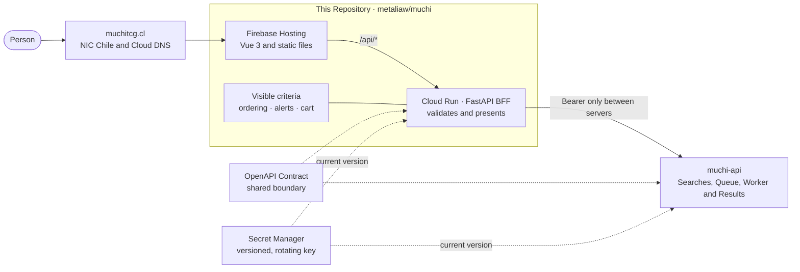
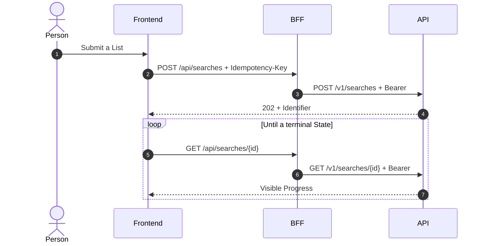
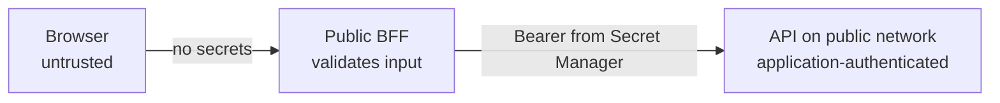

[English](architecture-en.md) · [Español](architecture.md)

# Muchi Architecture

Muchi separates what People see and can discuss from the Logic operating
the Service. The Interface, its Presentation criteria and the BFF live in
[metaliaw/muchi](https://github.com/metaliaw/muchi/blob/main/README.md). Search collection,
persistence and processing live in
[cangrejometralleta/muchi-api](https://github.com/cangrejometralleta/muchi-api),
alongside its [OpenAPI Contract](https://github.com/cangrejometralleta/muchi-api/blob/main/openapi.yaml).

Both Repositories are public. This Document describes the Frontend's
Architecture and Boundary. The Backend — Queue, Worker, Persistence and
Expiration — is described in muchi-api. Diagrams stay with their owning
Repository; unnoticed Copies grow stale.

## A Search's Journey



Cloud DNS tells clients where to find `muchitcg.cl`; it does not serve the
Application. Firebase Hosting delivers existing Files from its CDN and
forwards unresolved Routes — including `/api/*` — to Cloud Run. The BFF
calls the API and returns only the State and Results the Browser needs.
Inside that API box, Queue, Worker and Persistence are diagrammed in
[muchi-api](https://github.com/cangrejometralleta/muchi-api).

## A Deliberate Boundary

| Space | Responsibility | Why It Lives There |
| --- | --- | --- |
| `metaliaw/muchi` | Vue interface, BFF, Presentation criteria, public Configuration and Frontend documentation | Supports learning, reviewing the Experience and proposing Changes with Context. |
| `cangrejometralleta/muchi-api` | OpenAPI Contract, Source queries, Job coordination and persistence | Has its own Change cycle and Operations; Decisions are discussed where their Code lives. |
| Secret Manager | Key shared by BFF, API and Worker | Separates Credentials from Code, Images and the Browser; supports versioning and rotation. |

This separation keeps the Frontend inspectable. The Contract describes the
Conversation across the Boundary, and Rules transforming a Response into
a Recommendation remain open to inspection.

## Visible Criteria

Muchi publishes the Criteria affecting what a Person sees or buys:

- Offers open in ascending Price order within each Currency. Pesos and
  Dollars are not treated as the same Unit.
- Suspicious Prices and sold-out Stock are excluded from the Cart. Unknown
  Stock is shown as `No confirmado` (unconfirmed), rather than available.
- After a Search closes, Muchi asks again about Stock for each Card's
  cheapest Offer and crowns the first confirmed available. The API visits
  the Store; the BFF decides whom to ask and in what Order. Between a
  cheap unknown and a more expensive confirmed Offer, Confirmation wins.
  If every Store says no, the Card gets no Recommendation.
  [Checking Stock](api/stock-order-en.md) describes this Conversation
  and its three possible Answers.
- Only CLP and USD enter the Cart. Dollars convert using the public
  [Muchi Dollar](../config/rates.defaults.yaml).
- The Cart considers Card prices and one Shipping charge per Store.
  It uses a fast Heuristic documented in Code, without promising a
  mathematical Optimum.

These Decisions can be traced through
[`server/presenter.py`](../server/presenter.py),
[`muchi/mtg/optimizer.py`](../muchi/mtg/optimizer.py) and the
[OpenAPI Contract](https://github.com/cangrejometralleta/muchi-api/blob/main/openapi.yaml).
A Suggestion can therefore be discussed as a concrete Rule.

## Key Security and Rotation

The API Key is never compiled into Vue or sent to the Browser. The BFF
receives it from Secret Manager and adds `Authorization: Bearer` only
on the connection between Servers.

The Key is a versioned Secret. `./rotate-secret.sh` in
[muchi-api](https://github.com/cangrejometralleta/muchi-api) creates a new
Version and updates its three Consumers: BFF, API and Worker. Deployments
read the current Version. Neither the Value nor a backup belongs in Git,
the Image or public Configuration.

This Key protects the internal Boundary. It does not replace Usage limits,
Input validation, Audit logs or periodic Service account Permission reviews.

## The Reusable Pattern

The same Shape fits an Application that receives slow Work, queries
external Providers and lets the caller return for a Result. Products can
change while Responsibilities stay the same.

The journey above already shows this Shape. Naming each Part lets its
Responsibility change Provider without moving elsewhere:

| Responsibility | Reference Implementation | Possible Replacements |
| --- | --- | --- |
| Resolve the Domain | Cloud DNS | Registrar DNS, Route 53 or Cloudflare DNS. |
| Serve Files and terminate HTTPS | Firebase Hosting | A CDN with static Hosting and managed Certificates. |
| Keep Credentials out of the Browser | BFF on Cloud Run | A Function, Container or API Gateway with Transformation. |
| Accept and query Jobs | API on Cloud Run Functions | An HTTP service that persists State before replying. |
| Decouple slow Work | Cloud Tasks | A Queue with at-least-once delivery and Retries. |
| Execute each Unit | Internal Function | An authenticated Worker, Job or Consumer. |
| Store temporary State | Firestore with TTL | A transactional Database with Indexes and an Expiration policy. |
| Distribute Credentials | Secret Manager | A Secret manager with Versions and Auditing. |

Each Part needs one Responsibility. Boundaries must be replaceable without
moving Credentials or Business rules into the Browser. That choice matters
more than the Provider.

## A Slow Operation's Lifecycle

The initial Request does not wait for Sources to finish. The API records
it, queues its Units and returns a stable Identifier. The Browser uses
that Identifier to query Progress and can close or reload without losing
the Work.



Meanwhile, the API queues one Unit per Entry and its Worker queries the
Sources. That section is diagrammed in
[muchi-api](https://github.com/cangrejometralleta/muchi-api). What matters
here is that Progress appears before completion.

The Idempotency key prevents duplicate Work when the Client cannot tell
whether its first Submission arrived. A Queue may deliver a Task more
than once, so the Worker must repeat it without duplicating Effects.
Terminal States stop Polling, and the Interface retains the latest valid
Result after a transient Failure.

## Data, Expiration and Consistency

Three kinds of Data travel through the system:

- The Request and its State allow an Operation to resume. They have their
  own Identity and explicit Expiration.
- Partial Results grow while Units work. A Read can observe Progress
  without requiring global Consistency across all Units.
- Provider Cache avoids repeating expensive Queries. Its TTL balances
  Freshness and Cost, independently of the Request's Lifetime.

Muchi stores Searches, Items, Offers, Idempotency records and Cache in
Firestore with an `expires_at` Field. The API rejects an expired Document
even before the TTL process deletes it. Eventual cleanup therefore does
not become a Business rule.

When reproducing the Pattern, specify these decisions for each Collection or Table:

| Decision | Question to Answer |
| --- | --- |
| Identity | What makes a Request unique, and who can read it again? |
| Idempotency | Which Retry represents the same Command? |
| Terminal State | Which States stop Work and Polling? |
| Expiration | Which Event starts the clock, and who rejects expired records? |
| Indexes | Which Queries must stay cheap as Volume grows? |
| Retention | What must disappear for Privacy, Cost or Freshness? |

## Network, Domain and HTTPS

The public path has four independent Layers:

1. The Registrar delegates the Domain to the chosen Nameservers.
2. The DNS Zone publishes Records pointing to Hosting.
3. Hosting validates Ownership with a TXT record and issues the Certificate.
4. The CDN serves static Files and rewrites dynamic Routes to the BFF.

Here, the root Domain uses an `A` record pointing to Firebase Hosting.
Firebase manages ACME validation, Certificate issuance and renewal; no
manual Certificate is installed in the Container. Ownership and validation
TXT records must stay published while the Domain remains associated.

DNS translates a Name into a Destination. Hosting serves the Frontend at
low Latency and forwards dynamic traffic. The BFF adapts the public
Session to the API's internal Boundary. Each has its own role.

## Trust Boundaries



- The Frontend receives only public Configuration. An AdSense ID can be
  public; a Bearer Key cannot.
- The BFF is Internet-accessible because it serves the Application, but
  keeps the Secret in its runtime Environment.
- The API allows public Network traffic and requires Application
  authentication on protected Routes. Health may remain unauthenticated.
- The Worker rejects anonymous calls. The Queue invokes it using a
  Service identity and an OIDC token.
- Each Service uses a separate Account with only its required Roles:
  reading or writing Data, queuing Tasks, invoking the Worker or reading
  a Secret.
- All Data from external Sources is validated again before entering the
  Domain or Persistence.

A shared Key is a simple service-boundary Solution, not a User identity.
A replica with personal Accounts, per-User Permissions or multiple Clients
needs its own Authentication and Authorization.

## Build and Deployment

The Frontend is compiled in a Node stage and copied into a minimal Python
Image running FastAPI. Cloud Build produces an identifiable Image,
stores it in Artifact Registry and updates Cloud Run. The same Frontend
is then compiled for Firebase Hosting.

The Script follows a deliberate Order:

1. Check the Project, Tools and Secret existence.
2. Prepare Artifact Registry and grant required Permissions.
3. Build and publish the BFF on Cloud Run.
4. Compile the Frontend from a reproducible `package-lock.json`.
5. Publish Files to Firebase Hosting.

Publishing the Service first prevents a new Interface from calling Routes
the old BFF does not know. Incompatible Changes also require Contract
versioning or support for both Shapes during Migration.

The Backend deploys separately because its Change cycle differs. Its
Flow is described in [muchi-api](https://github.com/cangrejometralleta/muchi-api).

The API and BFF must deploy compatibly with the OpenAPI Contract.
Two Repositories still require that Discipline: whoever changes the
Boundary changes the Contract first, in its single owning location.

## How to Reproduce This Architecture

A new Implementation can follow this Sequence:

1. Define the HTTP Contract and Job states first: `queued`, `running`,
   terminal States and Error responses.
2. Build an idempotent Worker that processes one Unit and writes its
   Result. Test it without a Queue or HTTP.
3. Add Persistence with Expiration and an API for creating, querying
   and cancelling Jobs.
4. Introduce an authenticated Queue. Set Retries, Concurrency, Rate and
   Deadline according to the slowest Provider.
5. Build a BFF that translates the internal Contract into the public View
   and keeps Credentials out of the Browser.
6. Publish the Frontend on static Hosting with rewrites to the BFF,
   exposing one Origin to avoid unnecessary CORS configuration.
7. Create separate Service accounts and grant each Role after identifying
   the specific call that needs it.
8. Store Credentials in a Secret manager, reference Versions and rehearse
   Rotation before Production.
9. Delegate the Domain, add Hosting's requested Records and wait for
   automatic HTTPS issuance before announcing the URL.
10. Automate Build, Tests, Deployment and a Health check. Retain a Provider
    URL to recover access if the Domain fails.

Minimal variables for a replica:

```dotenv
APP_ENV=production
BACKEND_URL=https://api.example.invalid
BACKEND_TOKEN=<injected-from-secret-manager>
POLL_SECONDS=5
TASK_REGION=chosen-region
TASK_QUEUE=jobs
TASK_WORKER_URL=https://worker.example.invalid
TASK_SERVICE_ACCOUNT=queue-invoker@example.invalid
```

Names vary between Platforms; Categories remain: Environment, Destinations,
Timing, Topology and Secrets. Inject Secrets separately and never place
them in the Defaults file.

## Operations, Cost and Failures

Scaling to zero reduces idle Cost at the expense of a Cold start on the
first Request. The Queue absorbs Peaks and limits pressure on external
Sources. Low Concurrency protects slow Adapters but increases total Time
for large Lists.

Minimum operational Monitoring covers:

- BFF, API and Worker Latency and Error rates.
- Queue depth, age and Retries.
- Jobs stuck in `queued` or `running` beyond their Deadline.
- Invalid responses, blocks and timeouts per Source.
- Firestore usage, Index growth and TTL deletion.
- Secret Manager access failures and Revisions receiving no Traffic.
- Domain, HTTPS Certificate and Health endpoint status.

| Failure | Expected Behavior |
| --- | --- |
| BFF cannot reach the API | Keeps the visible Result and allows retrying the Read. |
| A Source fails | Marks the Unit with a Notice and allows completion with partial Errors. |
| A Task repeats | Worker recognizes the same Job and does not duplicate Results. |
| Worker is unavailable | Queue retries under a bounded, observable Policy. |
| Document expired | API rejects it even if TTL has not deleted it yet. |
| Domain fails | Hosting's managed URL remains available for diagnosis. |
| Key rotates | New Instances read the current Version; old Instances are replaced. |

## Decisions and Limits

- HTTP Polling is simple, recoverable and sufficient for spaced updates.
  WebSockets or Server-Sent Events add Complexity and are justified only
  when update Latency requires them.
- A BFF reduces Exposure and keeps Secrets out of the Frontend, while
  adding a Network hop. Placing it in the API's Region reduces that Cost.
- A document Database fits partial Results and TTL. Strong Relationships,
  complex reporting or extensive Transactions may justify SQL.
- At-least-once processing requires Idempotency. Claiming exactly-once
  delivery moves the same Problem to a less visible Layer.
- A fast Heuristic may beat a costly Optimum when the Interface declares
  that Limit and lets the Person review the Result.
- Separate Frontend and API Repositories keep Decisions with their Code,
  but require an explicit Contract and links between owning Documents.
  Copies silently grow stale.

## Learn and Contribute

Muchi's public side is also intended as a Learning path:

1. [`web/src/App.vue`](../web/src/App.vue) shows how the Experience is composed.
2. [`web/src/api.js`](../web/src/api.js) shows the Contract consumed by the Browser.
3. [`server/main.py`](../server/main.py) shows the BFF Boundary.
4. [`server/presenter.py`](../server/presenter.py) makes Presentation rules explicit.
5. [`firebase.json`](../firebase.json) and [`deploy.sh`](../deploy.sh) show
   how Firebase Hosting, Cloud Run and Secret Manager work together.

You can [open an Issue](https://github.com/metaliaw/muchi/issues/new) to
report a Problem, question a Criterion, propose an Improvement or request
clearer documentation. Pull Requests to the public Repository are welcome.
Stores wishing to share Stock can use the
[Integration guide](../share-store-stock-en.md).

Do not publish Keys, personal Data or exploitable details in an Issue.
Describe the observable Effect and request a private Channel for sensitive Reports.
