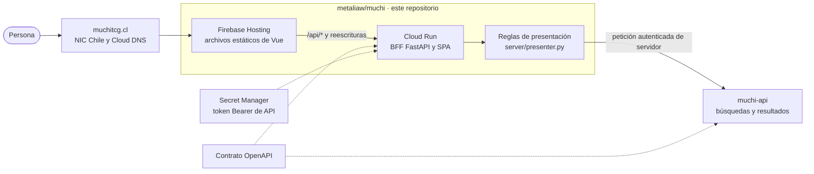
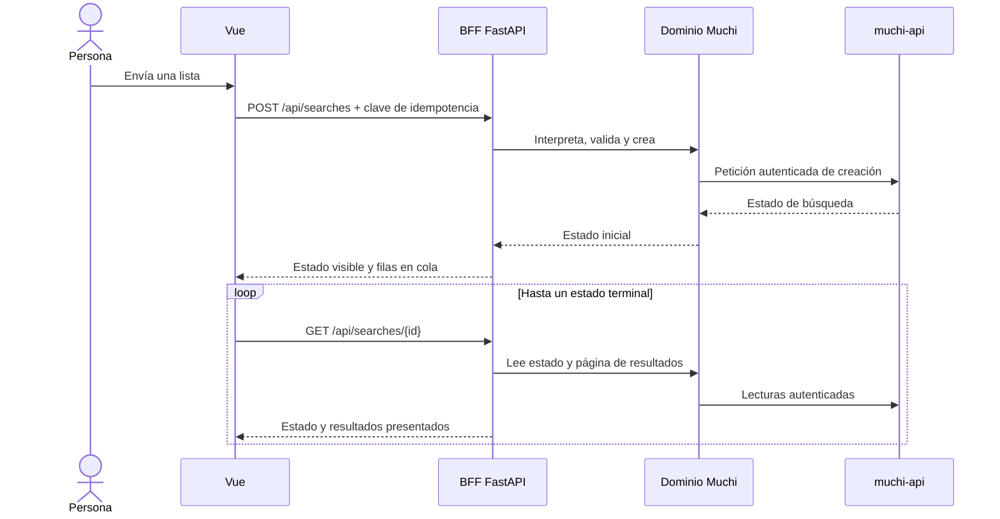

[English](architecture.md) · **Español**

# Arquitectura del BFF de Muchi

Muchi tiene dos repositorios públicos con responsabilidades distintas. Este
repositorio posee la experiencia Vue, sus reglas de presentación y el
Backend-for-Frontend (BFF) en FastAPI. El
[repositorio muchi-api](https://github.com/cangrejometralleta/muchi-api)
posee la recepción de búsquedas, la Cola, los Workers, la Persistencia, la
Caducidad y la recuperación. Cada repositorio documenta su propia arquitectura;
esta página describe la frontera con el Navegador.

## El Recorrido Público

Cloud DNS resuelve el nombre público. Firebase Hosting sirve la Interfaz
compilada y envía las peticiones `/api/*` al BFF. El BFF valida entradas
públicas, llama al dominio Muchi y usa la credencial de API del lado servidor
para cruzar la frontera entre repositorios. Vue nunca recibe esa credencial.

## Para Qué Existe el BFF

El BFF mantiene la autenticación de API fuera del Navegador y da a Vue
respuestas adaptadas a la Interfaz. También posee los límites públicos y las
decisiones de presentación sobre orden de ofertas, etiquetas de stock y
contenido del carrito. Estas reglas se pueden leer en
[`server/main.py`](../server/main.py) y
[`server/presenter.py`](../server/presenter.py); no quedan ocultas en el
paquete compilado del cliente.

El BFF no es el buscador. Delega las operaciones de búsqueda, stock y
resultados al dominio Muchi, que llama a la API separada. La Cola, los Workers,
la Persistencia, el TTL y la recuperación pertenecen a esa API y se describen
en su [documento de arquitectura](https://github.com/cangrejometralleta/muchi-api/blob/main/docs/architecture.es.md).

## Una Búsqueda a Través del BFF

La API persiste el trabajo lento antes de responder. El BFF devuelve un estado
inicial y luego combina estado y páginas de resultados durante el sondeo. La
clave de idempotencia permite reintentar una creación incierta; la API posee
la idempotencia de los Workers y el comportamiento de la Cola.

## Entrypoints del BFF

Cada ruta pública tiene su propia explicación de propósito, entrada y frontera
en la [guía de entrypoints del BFF](bff/README.es.md). El índice se organiza
por las tareas que habilita cada ruta, desde servir Vue hasta crear y presentar
búsquedas.

## Seguridad y Operación

El Navegador llama al BFF desde el mismo origen público que la Aplicación. El
BFF valida las formas de entrada y conserva el token Bearer en su entorno de
servidor. La API autentica las llamadas protegidas. Las identidades de Workers
y del Scheduler están fuera de esta frontera y se explican en la arquitectura
de la API.

Cloud Run puede escalar el BFF a cero, a cambio de un arranque frío en la
primera petición. Se monitorean latencia, errores, fallos de la API, acceso al
Secreto y salud del BFF. Las métricas de Cola, Workers y fuentes externas
pertenecen a la operación de la API.

## Frontera de Despliegue

El script compila y despliega el BFF antes de publicar el Front estático nuevo.
Ese orden permite que la nueva Interfaz llame rutas que el BFF activo ya
conoce. La API se despliega por separado; ambos repositorios deben mantenerse
compatibles con el contrato OpenAPI que posee muchi-api.

Consulta [`deploy.sh`](../deploy.sh), [`cloudbuild.yaml`](../cloudbuild.yaml)
y [El Front y su frontera](web-migration.es.md) para los detalles de despliegue
de este repositorio.
