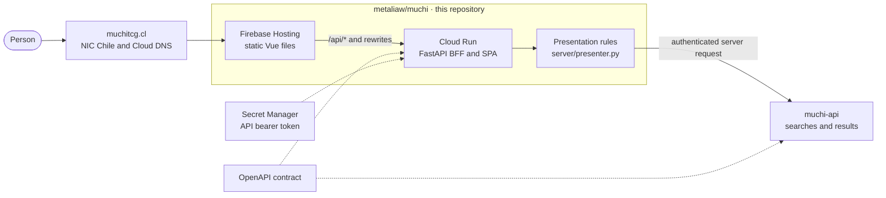
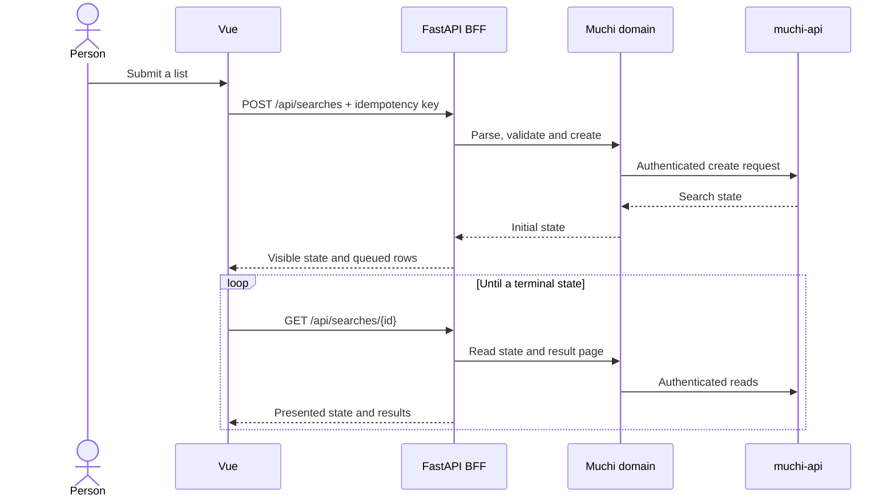

[English](architecture.md) · [Español](architecture.es.md)

# Muchi BFF Architecture

Muchi has two public repositories with different responsibilities. This
repository owns the Vue experience, its presentation rules and the FastAPI
Backend-for-Frontend (BFF). The
[muchi-api repository](https://github.com/cangrejometralleta/muchi-api)
owns search collection, queueing, workers, persistence, expiration and
recovery. Each repository documents its own architecture; this page describes
the browser-facing boundary.

## The Public Request Path

Cloud DNS resolves the public name. Firebase Hosting serves the compiled
interface and sends `/api/*` requests to the BFF. The BFF validates public
inputs, calls the Muchi domain, and uses the server-side API credential for
requests across the repository boundary. Vue never receives that credential.

## Why the BFF Exists

The BFF keeps API authentication out of the browser and gives Vue response
shapes that already match the interface. It also owns public limits and
presentation decisions such as offer ordering, stock labels and cart output.
These rules are visible in [`server/main.py`](../server/main.py) and
[`server/presenter.py`](../server/presenter.py), rather than hidden in a
compiled client bundle.

The BFF is not the search engine. It delegates search, stock and result
operations to the Muchi domain, which calls the separate API. Queue dispatch,
workers, persistence, TTL and queue recovery belong to that API and are
described in its
[architecture document](https://github.com/cangrejometralleta/muchi-api/blob/main/docs/architecture.md).

## A Search Through the BFF

The search API persists slow work before it responds. The BFF returns an
initial state, then combines state and result pages during polling. The
idempotency key makes an uncertain create retry safe; the API owns worker
idempotency and queue behavior.

## BFF Entry Points

Each public route has its own explanation of its purpose, input and boundary
in the [BFF entry-point guide](bff/README.md). The index is arranged by the
task each route enables, from serving the Vue application to creating and
presenting searches.

## Security and Operations

The browser calls the BFF from the same public origin as the application. The
BFF validates request shapes and keeps the bearer token in its server runtime.
The API authenticates protected calls. Worker and scheduler identities are
outside this repository's boundary and are described by the API architecture.

Cloud Run can scale the BFF to zero, trading idle cost for a cold start on the
first request. Monitor BFF latency, errors, downstream API failures, secret
access and health. The independent backend queue, worker and source metrics
belong to the API's operational guide.

## Deployment Boundary

The deployment script builds and deploys the BFF before publishing the new
static Frontend. This order lets a new interface call routes the live BFF
already understands. The API deploys separately; both repositories must remain
compatible with the OpenAPI contract owned by muchi-api.

See [`deploy.sh`](../deploy.sh), [`cloudbuild.yaml`](../cloudbuild.yaml), and
the [Frontend and its boundary](web-migration.md) for this repository's
deployment details.
