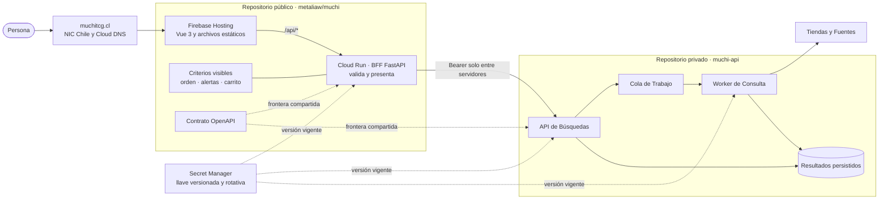

# Arquitectura de Muchi

Muchi separa lo que las Personas ven y pueden discutir de la Lógica que opera
el Servicio. La Interfaz, sus Criterios de Presentación y el Contrato con la API
viven en el [Repositorio público](https://github.com/metaliaw/muchi). La
recolección, persistencia y procesamiento de las Búsquedas viven en un
Repositorio privado.

No toda la Plataforma es Código abierto. La propuesta abierta consiste en
dejar a la Vista las Decisiones que afectan a quien busca, ofrecer un Contrato
legible y aceptar Conversaciones y Cambios sobre la Experiencia pública.

## El Recorrido de una Búsqueda

Cloud DNS dice dónde encontrar `muchitcg.cl`; no sirve la Aplicación. Firebase
Hosting entrega el Front desde su CDN y deriva las Rutas `/api/*` a Cloud Run.
El BFF llama a la API privada y devuelve al Navegador solamente el Estado y los
Resultados que necesita presentar.

## Una Frontera Deliberada

| Espacio | Responsabilidad | Por qué vive ahí |
| --- | --- | --- |
| Repositorio público | Interfaz Vue, BFF, Criterios de Presentación, Configuración pública, Contrato OpenAPI y Documentación | Permite aprender, revisar la Experiencia y proponer Cambios con Contexto. |
| Repositorio privado | Consulta de Fuentes, coordinación de Trabajos, persistencia y Lógica operativa de Producción | Limita la Exposición de Integraciones y Controles cuya publicación facilitaría el Abuso del Servicio. |
| Secret Manager | Llave compartida por BFF, API y Worker | Separa Credenciales del Código, de la Imagen y del Navegador; permite versionarlas y rotarlas. |

La separación no convierte al Front en una Cáscara opaca. El Contrato público
describe la Conversación entre ambos lados, y las Reglas que transforman una
Respuesta en una Recomendación permanecen inspeccionables.

## Criterios a la Vista

Muchi publica los Criterios que cambian lo que una Persona ve o compra:

- Las Ofertas se abren de menor a mayor Precio dentro de cada Moneda. Pesos y
  Dólares no se comparan como si fueran la misma Unidad.
- Las Ofertas con Precio sospechoso o Stock agotado quedan fuera del Carrito.
  Un Stock desconocido se muestra como `No confirmado`, no como disponible.
- Solo CLP y USD participan en el Carrito. Los Dólares se convierten con el
  [Muchi Dólar](../config/rates.defaults.yaml), cuyo Valor es público.
- El Carrito considera el Precio de las Cartas y un Envío por Tienda. Utiliza
  una Heurística rápida, documentada en el Código, que no promete el Óptimo
  matemático.

Estas Decisiones pueden seguirse en
[`server/presenter.py`](../server/presenter.py),
[`muchi/mtg/optimizer.py`](../muchi/mtg/optimizer.py) y en el
[`Contrato OpenAPI`](api/openapi.yaml). Así una sugerencia puede discutirse
como una Regla concreta y no como el resultado inexplicable de una Caja negra.

## Seguridad y Rotación de la Llave

La Llave de la API nunca se compila dentro de Vue ni se envía al Navegador. El
BFF la recibe desde Secret Manager y la agrega como `Authorization: Bearer`
solo en la Conexión entre Servidores.

La Llave es un Secreto versionado. `./rotate-secret.sh`, en el Repositorio
privado, crea una Versión nueva y actualiza los tres Consumidores: BFF, API y
Worker. Los Despliegues leen la Versión vigente; ni el Valor ni una copia de
respaldo deben guardarse en Git, en la Imagen o en la Configuración pública.

Esta Llave protege la Frontera interna. No reemplaza los Límites de Uso, la
validación de Entradas, los Registros de Auditoría ni la revisión periódica de
Permisos de las Cuentas de Servicio.

## Aprender y Colaborar

Muchi quiere que su parte pública sirva también como una Ruta de Aprendizaje:

1. [`web/src/App.vue`](../web/src/App.vue) muestra cómo se compone la Experiencia.
2. [`web/src/api.js`](../web/src/api.js) muestra el Contrato que consume el Navegador.
3. [`server/main.py`](../server/main.py) muestra la Frontera del BFF.
4. [`server/presenter.py`](../server/presenter.py) hace explícitas las Reglas de Presentación.
5. [`firebase.json`](../firebase.json) y [`deploy.sh`](../deploy.sh) muestran cómo
   conviven Firebase Hosting, Cloud Run y Secret Manager.

Puedes [abrir una Incidencia](https://github.com/metaliaw/muchi/issues/new) para
reportar un Problema, cuestionar un Criterio, proponer una Mejora o pedir que
una Decisión quede mejor documentada. También puedes enviar un Pull Request al
Repositorio público. Las Tiendas que quieran compartir Stock tienen una
[Guía de Integración](../INTEGRAR-TIENDA.md).

No publiques Llaves, Datos personales ni detalles explotables en una
Incidencia. Describe el Efecto observable y pide un Canal privado cuando el
Reporte sea sensible.
