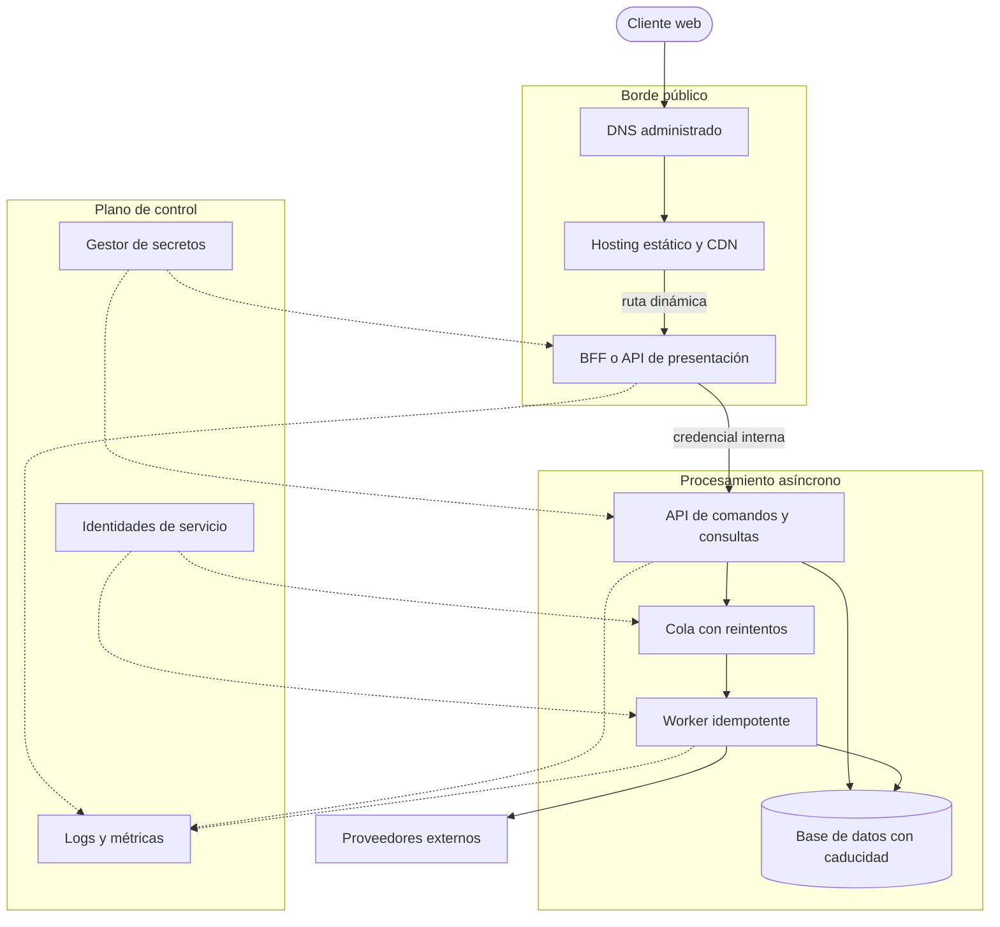
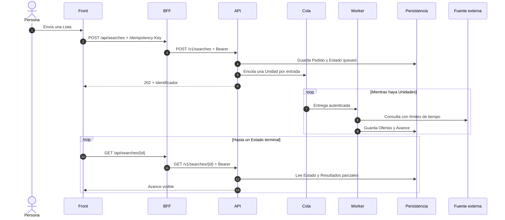
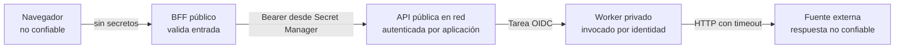

# Arquitectura de Muchi

Muchi separa lo que las Personas ven y pueden discutir de la Lógica que opera
el Servicio. La Interfaz, sus Criterios de Presentación y el Contrato con la API
viven en el [Repositorio público](https://github.com/metaliaw/muchi). La
recolección, persistencia y procesamiento de las Búsquedas viven en un
Repositorio privado.

No toda la Plataforma es Código abierto. La propuesta abierta consiste en
dejar a la Vista las Decisiones que afectan a quien busca, ofrecer un Contrato
legible y aceptar Conversaciones y Cambios sobre la Experiencia pública.

## El Recorrido de una Búsqueda


Cloud DNS dice dónde encontrar `muchitcg.cl`; no sirve la Aplicación. Firebase
Hosting entrega los Archivos existentes desde su CDN y deriva las Rutas que no
resuelve —incluidas `/api/*`— a Cloud Run. El BFF llama a la API privada y
devuelve al Navegador solamente el Estado y los Resultados que necesita
presentar.

## Una Frontera Deliberada

| Espacio | Responsabilidad | Por qué vive ahí |
| --- | --- | --- |
| Repositorio público | Interfaz Vue, BFF, Criterios de Presentación, Configuración pública, Contrato OpenAPI y Documentación | Permite aprender, revisar la Experiencia y proponer Cambios con Contexto. |
| Repositorio privado | Consulta de Fuentes, coordinación de Trabajos, persistencia y Lógica operativa de Producción | Limita la Exposición de Integraciones y Controles cuya publicación facilitaría el Abuso del Servicio. |
| Secret Manager | Llave compartida por BFF, API y Worker | Separa Credenciales del Código, de la Imagen y del Navegador; permite versionarlas y rotarlas. |

La separación no convierte al Front en una Cáscara opaca. El Contrato público
describe la Conversación entre ambos lados, y las Reglas que transforman una
Respuesta en una Recomendación permanecen inspeccionables.

## Criterios a la Vista

Muchi publica los Criterios que cambian lo que una Persona ve o compra:

- Las Ofertas se abren de menor a mayor Precio dentro de cada Moneda. Pesos y
  Dólares no se comparan como si fueran la misma Unidad.
- Las Ofertas con Precio sospechoso o Stock agotado quedan fuera del Carrito.
  Un Stock desconocido se muestra como `No confirmado`, no como disponible.
- Solo CLP y USD participan en el Carrito. Los Dólares se convierten con el
  [Muchi Dólar](../config/rates.defaults.yaml), cuyo Valor es público.
- El Carrito considera el Precio de las Cartas y un Envío por Tienda. Utiliza
  una Heurística rápida, documentada en el Código, que no promete el Óptimo
  matemático.

Estas Decisiones pueden seguirse en
[`server/presenter.py`](../server/presenter.py),
[`muchi/mtg/optimizer.py`](../muchi/mtg/optimizer.py) y en el
[`Contrato OpenAPI`](api/openapi.yaml). Así una sugerencia puede discutirse
como una Regla concreta y no como el resultado inexplicable de una Caja negra.

## Seguridad y Rotación de la Llave

La Llave de la API nunca se compila dentro de Vue ni se envía al Navegador. El
BFF la recibe desde Secret Manager y la agrega como `Authorization: Bearer`
solo en la Conexión entre Servidores.

La Llave es un Secreto versionado. `./rotate-secret.sh`, en el Repositorio
privado, crea una Versión nueva y actualiza los tres Consumidores: BFF, API y
Worker. Los Despliegues leen la Versión vigente; ni el Valor ni una copia de
respaldo deben guardarse en Git, en la Imagen o en la Configuración pública.

Esta Llave protege la Frontera interna. No reemplaza los Límites de Uso, la
validación de Entradas, los Registros de Auditoría ni la revisión periódica de
Permisos de las Cuentas de Servicio.

## El Patrón Reutilizable

La misma Forma sirve para una Aplicación que recibe un Trabajo lento, consulta
Proveedores externos y permite volver por el Resultado. Los Productos concretos
pueden cambiar sin cambiar las Responsabilidades:



| Responsabilidad | Implementación de referencia | Sustitutos posibles |
| --- | --- | --- |
| Resolver el Dominio | Cloud DNS | El DNS del Registrador, Route 53 o Cloudflare DNS. |
| Servir Archivos y terminar HTTPS | Firebase Hosting | Un CDN con Hosting estático y Certificados administrados. |
| Proteger Credenciales del Navegador | BFF en Cloud Run | Una Función, un Contenedor o un API Gateway con Transformación. |
| Aceptar y consultar Trabajos | API en Cloud Run Functions | Un Servicio HTTP que persista Estado antes de responder. |
| Desacoplar Trabajo lento | Cloud Tasks | Una Cola que entregue al menos una vez y permita Reintentos. |
| Ejecutar cada Unidad | Función privada | Un Worker, Job o Consumidor autenticado. |
| Conservar Estado temporal | Firestore con TTL | Una Base transaccional con Índices y política de Caducidad. |
| Distribuir Credenciales | Secret Manager | Un Gestor de Secretos con Versiones y Auditoría. |

La elección importante no es el Proveedor. Es que cada Pieza tenga una sola
Responsabilidad y que las Fronteras se puedan sustituir sin trasladar
Credenciales o Reglas de Negocio al Navegador.

## Ciclo de una Operación Lenta

El Pedido inicial no espera a que terminen las Fuentes. La API lo registra,
encola sus Unidades y responde con un Identificador estable. El Navegador usa
ese Identificador para consultar el Avance y puede cerrar o recargar la Página
sin perder el Trabajo.



La Clave de Idempotencia evita duplicar un Trabajo cuando el Cliente no sabe si
su primer Envío llegó. La Cola puede entregar una Tarea más de una vez; por eso
el Worker debe poder repetirla sin duplicar Efectos. Los Estados terminales
detienen el Sondeo y la Interfaz conserva el último Resultado válido ante un
Fallo transitorio.

## Datos, Caducidad y Consistencia

Tres Clases de Dato recorren la Solución:

- El Pedido y su Estado permiten reanudar una Operación. Tienen Identidad propia
  y una Caducidad explícita.
- Los Resultados parciales crecen mientras trabajan las Unidades. Una Lectura
  puede observar Progreso sin exigir Consistencia global entre todas ellas.
- La Caché de Proveedores evita repetir Consultas costosas. Su TTL responde a
  frescura y costo; no debe confundirse con la Vida del Pedido.

En Muchi, Firestore conserva Búsquedas, Ítems, Ofertas, Idempotencia y Caché con
el Campo `expires_at`. La API rechaza un Documento vencido aunque el Proceso TTL
aún no lo haya eliminado. Esto evita convertir una Limpieza eventual en una
Regla de Negocio.

Al replicar el Patrón, conviene declarar por cada Colección o Tabla:

| Decisión | Pregunta que debe responder |
| --- | --- |
| Identidad | ¿Qué hace único al Pedido y quién puede volver a leerlo? |
| Idempotencia | ¿Qué Reintento representa el mismo Comando? |
| Estado terminal | ¿Qué Estados detienen Trabajo y Sondeo? |
| Caducidad | ¿Desde qué Evento se calcula y quién rechaza lo vencido? |
| Índices | ¿Qué Consultas deben seguir siendo baratas al crecer el Volumen? |
| Retención | ¿Qué debe desaparecer por privacidad, costo o frescura? |

## Red, Dominio y HTTPS

El Camino público se arma en cuatro Capas independientes:

1. El Registrador delega el Dominio a los Nameservers elegidos.
2. La Zona DNS publica los Registros que apuntan al Hosting.
3. El Hosting valida la Propiedad mediante un TXT y emite el Certificado.
4. El CDN sirve Archivos estáticos y reescribe las Rutas dinámicas al BFF.

En esta Instalación, el Dominio raíz usa un Registro `A` hacia Firebase Hosting.
Firebase administra la validación ACME, la emisión y la renovación del
Certificado; no se instala un Certificado manual en el Contenedor. Los TXT de
Propiedad y validación deben permanecer publicados mientras el Dominio esté
asociado.

DNS no reemplaza al Hosting: solo traduce un Nombre a un Destino. El Hosting no
reemplaza al BFF: entrega el Front con baja Latencia y deriva lo dinámico. El BFF
no reemplaza a la API: adapta la Sesión pública a una Frontera interna.

## Fronteras de Confianza



- El Front recibe solamente Configuración pública. Un Identificador de AdSense
  puede publicarse; una Llave Bearer no.
- El BFF es accesible desde Internet porque sirve la Aplicación, pero conserva
  el Secreto en su Entorno de ejecución.
- La API permite tráfico de red público y exige Autenticación de Aplicación en
  sus Rutas protegidas. Salud puede permanecer sin Credenciales.
- El Worker rechaza invocaciones anónimas. La Cola lo llama con una Identidad de
  Servicio y un Token OIDC.
- Cada Servicio usa una Cuenta distinta y recibe solo los Roles necesarios:
  leer o escribir Datos, encolar Tareas, invocar el Worker o leer un Secreto.
- Todo Dato recibido de una Fuente externa vuelve a validarse antes de entrar al
  Dominio o a la Persistencia.

Una Llave compartida es una Solución simple para una Frontera entre Servicios,
no una Identidad de Usuario. Una réplica con Cuentas personales, permisos por
Usuario o múltiples Clientes necesita Autenticación y Autorización propias.

## Construcción y Despliegue

El Front se compila en una Etapa Node y se copia a una Imagen Python mínima que
ejecuta FastAPI. Cloud Build produce una Imagen identificable, la guarda en
Artifact Registry y actualiza Cloud Run. Después se compila el mismo Front para
Firebase Hosting.

El Orden del Script es deliberado:

1. Verifica Proyecto, Herramientas y existencia del Secreto.
2. Prepara Artifact Registry y concede los Permisos requeridos.
3. Construye y publica el BFF en Cloud Run.
4. Compila el Front desde un `package-lock.json` reproducible.
5. Publica los Archivos en Firebase Hosting.

Publicar primero el Servicio evita que una Interfaz nueva empiece a llamar una
Ruta que el BFF anterior todavía no conoce. Para Cambios incompatibles se
necesita además versionar el Contrato o mantener ambas Formas durante la
Migración.

El Backend usa otro Despliegue porque tiene otro Ciclo de Cambio. Ese Flujo:

1. Habilita Servicios administrados y comprueba el Secreto vigente.
2. Crea Cuentas con Responsabilidades separadas.
3. Configura TTL de Firestore y capacidad de la Cola.
4. Publica primero el Worker privado y obtiene su URL real.
5. Concede invocación a la Identidad de la Cola.
6. Publica la API con la URL del Worker y la Versión `latest` del Secreto.

La API y el BFF deben desplegarse de forma compatible con el Contrato OpenAPI.
Un Repositorio privado no elimina esa Disciplina: la Copia pública del Contrato
debe sincronizarse cuando cambia la Frontera.

## Cómo Replicar esta Arquitectura

Una Implementación nueva puede seguir esta Secuencia:

1. Define primero el Contrato HTTP y los Estados del Trabajo: `queued`,
   `running`, Estados terminales y Respuestas de Error.
2. Construye un Worker idempotente que procese una sola Unidad y escriba su
   Resultado. Pruébalo sin Cola ni HTTP.
3. Agrega Persistencia con Caducidad y una API que cree, consulte y cancele
   Trabajos.
4. Introduce una Cola autenticada. Configura Reintentos, Concurrencia, Ritmo y
   Deadline según el Proveedor más lento.
5. Construye un BFF que traduzca el Contrato interno a la Vista pública y
   conserve las Credenciales fuera del Navegador.
6. Publica el Front en un Hosting estático con Reescritura al BFF y un solo
   Origen visible para evitar una Configuración CORS innecesaria.
7. Crea Cuentas de Servicio separadas y concede cada Rol después de identificar
   la llamada concreta que lo necesita.
8. Guarda Credenciales en un Gestor de Secretos, referencia Versiones y ensaya
   la Rotación antes de Producción.
9. Delega el Dominio, añade los Registros solicitados por el Hosting y espera la
   emisión automática de HTTPS antes de anunciar la URL.
10. Automatiza Build, Pruebas, Despliegue y una Comprobación de Salud. Conserva
    una URL del Proveedor para recuperar el Servicio si falla el Dominio.

Variables mínimas de una réplica:

```dotenv
APP_ENV=production
BACKEND_URL=https://api.example.invalid
BACKEND_TOKEN=<inyectado-desde-el-gestor-de-secretos>
POLL_SECONDS=5
TASK_REGION=region-elegida
TASK_QUEUE=trabajos
TASK_WORKER_URL=https://worker.example.invalid
TASK_SERVICE_ACCOUNT=queue-invoker@example.invalid
```

Los Nombres cambian entre Plataformas; las Categorías no: Entorno, Destinos,
Tiempos, Topología y Secretos. Los Secretos se inyectan por separado y nunca se
incluyen en el Archivo de Defaults.

## Operación, Costo y Fallos

El escalado a cero reduce el Costo cuando no hay Tráfico, a cambio de un Arranque
frío en la primera Petición. La Cola absorbe Picos y limita la presión sobre las
Fuentes externas. La Concurrencia baja protege Adaptadores lentos, pero aumenta
el Tiempo total de una Lista grande.

Una Operación mínima debe observar:

- Latencia y proporción de Errores del BFF, API y Worker.
- Profundidad, antigüedad y Reintentos de la Cola.
- Trabajos detenidos en `queued` o `running` más allá de su Deadline.
- Tasa de respuestas inválidas, bloqueos y timeouts por Fuente.
- Uso de Firestore, crecimiento de Índices y eliminación mediante TTL.
- Fallos de acceso a Secret Manager y revisiones sin Tráfico.
- Estado del Dominio, Certificado HTTPS y endpoint de Salud.

| Fallo | Comportamiento esperado |
| --- | --- |
| El BFF no alcanza la API | Conserva el Resultado visible y permite reintentar la Lectura. |
| Una Fuente falla | Marca la Unidad con Aviso y permite terminar con Errores parciales. |
| Una Tarea se repite | El Worker reconoce el mismo Trabajo y no duplica Resultados. |
| El Worker no está disponible | La Cola reintenta según una Política acotada y observable. |
| El Documento venció | La API lo rechaza aunque el TTL todavía no lo haya borrado. |
| Falla el Dominio | La URL administrada de Hosting continúa disponible para diagnóstico. |
| Se rota la Llave | Las nuevas Instancias leen la Versión vigente y las antiguas se reemplazan. |

## Decisiones y Límites

- El Sondeo HTTP es simple, recuperable y suficiente para Avances espaciados.
  WebSockets o Server-Sent Events añaden Complejidad y solo convienen si la
  Latencia de actualización lo justifica.
- Un BFF reduce Exposición y evita entregar Secretos al Front, pero agrega un
  Salto de red. Ubicarlo en la misma Región que la API reduce ese Costo.
- Una Base documental encaja con Resultados parciales y TTL. Relaciones fuertes,
  reportes complejos o Transacciones extensas pueden justificar SQL.
- El Procesamiento al menos una vez exige Idempotencia. Pretender una Entrega
  exactamente una vez traslada el mismo Problema a una Capa menos visible.
- Una Heurística rápida puede ser preferible a un Óptimo costoso si la Interfaz
  declara esa Limitación y permite revisar el Resultado.
- Mantener la Lógica operativa privada protege Integraciones, pero obliga a
  publicar Contratos, Criterios visibles y Canales de discusión para sostener la
  Transparencia prometida.

## Aprender y Colaborar

Muchi quiere que su parte pública sirva también como una Ruta de Aprendizaje:

1. [`web/src/App.vue`](../web/src/App.vue) muestra cómo se compone la Experiencia.
2. [`web/src/api.js`](../web/src/api.js) muestra el Contrato que consume el Navegador.
3. [`server/main.py`](../server/main.py) muestra la Frontera del BFF.
4. [`server/presenter.py`](../server/presenter.py) hace explícitas las Reglas de Presentación.
5. [`firebase.json`](../firebase.json) y [`deploy.sh`](../deploy.sh) muestran cómo
   conviven Firebase Hosting, Cloud Run y Secret Manager.

Puedes [abrir una Incidencia](https://github.com/metaliaw/muchi/issues/new) para
reportar un Problema, cuestionar un Criterio, proponer una Mejora o pedir que
una Decisión quede mejor documentada. También puedes enviar un Pull Request al
Repositorio público. Las Tiendas que quieran compartir Stock tienen una
[Guía de Integración](../INTEGRAR-TIENDA.md).

No publiques Llaves, Datos personales ni detalles explotables en una
Incidencia. Describe el Efecto observable y pide un Canal privado cuando el
Reporte sea sensible.
