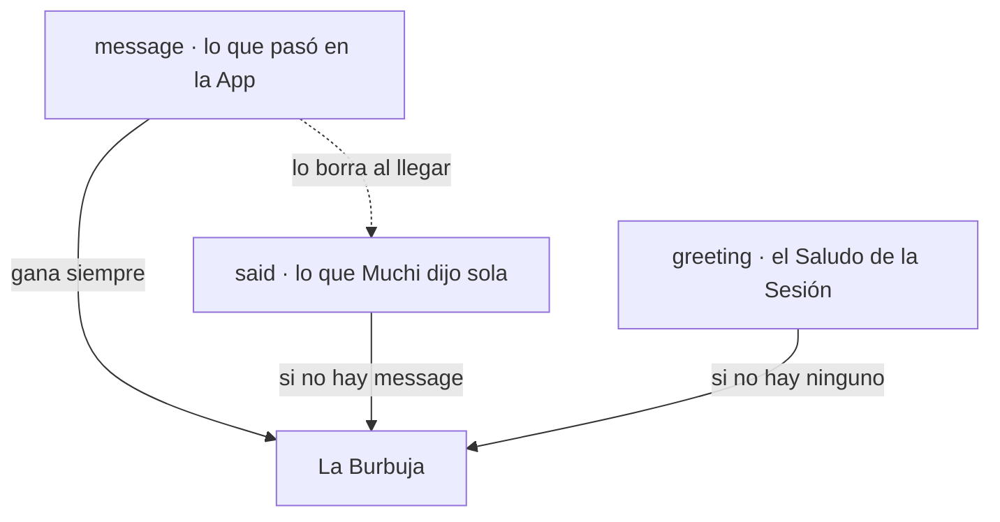
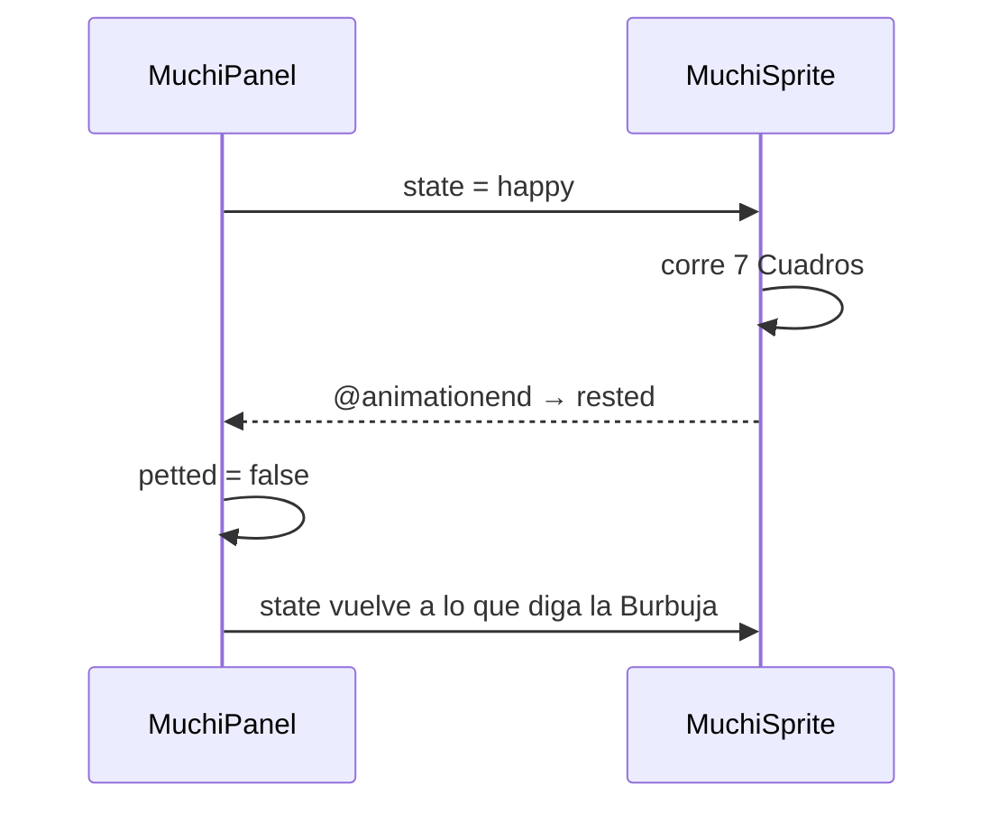

[English](how-muchi-speaks-en.md) · [Español](how-muchi-speaks.md)

# Cómo Habla Muchi

Muchi es un Gato que comenta lo que está pasando. Dice «ya salí a buscar»,
se queja cuando una Tienda no tiene Stock, se despierta si la acaricias y
cambia de Cara mientras lo dice. Este Documento cuenta las tres Piezas que
hacen eso y por qué están separadas.

| Pieza | Responde | Dónde vive |
| --- | --- | --- |
| El Catálogo | Qué puede decir Muchi | [`constants/phrases.yaml`](../constants/phrases.yaml) en el Servidor |
| La Burbuja | Qué dice ahora, y quién le ganó el turno | [`MuchiPanel.vue`](../web/src/components/MuchiPanel.vue) |
| La Hoja | Cómo se ve mientras lo dice | [`MuchiSprite.vue`](../web/src/components/MuchiSprite.vue) |

Las tres se hablan con un solo Vocabulario: cinco Estados. Un Texto no dice
«ponte contenta», dice `happy`, y la Hoja ya sabe qué Fila es esa.

## Los cinco Estados

El Estado es el Protocolo visual. Lo declara el Servidor en
[`muchi/mtg/phrases.py`](../muchi/mtg/phrases.py) como
`STATES = frozenset({"idle", "talk", "happy", "alert", "angry"})`, y lo dibuja
la Hoja de Sprites con una Fila por cada uno.

| Estado | Cuándo aparece | Fila | Cuadros | Ritmo | Vuelve sola |
| --- | --- | --- | --- | --- | --- |
| `idle` | Reposo, y Muchi cancelando una Búsqueda | 0 | 16 | 130 ms | Cicla |
| `talk` | Saludos y Sugerencias de Nombre | 1 | 6 | 90 ms | Cicla |
| `happy` | Búsqueda enviada, Caricia, Modo Oscuro | 2 | 8 | 80 ms | Termina y avisa |
| `alert` | Nervios del Catálogo, Modo Claro | 3 | 6 | 100 ms | Termina y avisa |
| `angry` | Cualquier Fallo que Muchi cuenta | 4 | 6 | 90 ms | Termina y avisa |

Los Números viven en [`web/src/assets/muchi-sheets.json`](../web/src/assets/muchi-sheets.json),
no en el Código. Cambiar el Ritmo de `talk` es editar un `ms`, y
[`docs/muchi-sprite-lab.html`](muchi-sprite-lab.html) permite mirarlos cuadro a
cuadro antes de tocar la Hoja.

Un Estado que la Hoja no dibuja cae en `idle` antes de pedir una Fila que no
existe. Sin ese Resguardo el Film se iría fuera de la Hoja y Muchi quedaría en
blanco: un Texto mal escrito apagaría al Gato en vez de sonar raro.

## El Catálogo vive en el Servidor

Todo lo que Muchi puede decir está en un solo Archivo, y el Front no trae ni
una Frase compilada adentro:

```yaml
every: 10
phrases:
  - state: angry
    phrases:
      - ¿Otra vez sin Stock? Grrr, las Tiendas se portan mal
greetings:
  - text: Miau, ¿en qué te ayudo?
    state: talk
```

`GET /api/muchi` lo entrega entero: `every`, `phrases`, `greetings`, `dark`,
`light`, `nerd`, `libre` y `help`. El Front lo pide una vez al montar, junto con
`/api/config`, y lo guarda en el `book`.

La Separación tiene un Motivo concreto: una Frase nueva no debería exigir un
Build del Front ni un Despliegue de Hosting. El Texto es Contenido, no Código.

El Servidor no es tolerante con ese Contenido. `build_phrase_book` exige las
ocho Claves exactas, rechaza un Grupo vacío, un `every` que no sea Entero
positivo y —sobre todo— un Estado fuera de los cinco. La Validación ocurre al
leer, no al dibujar: un `state: contenta` revienta en el Servidor con un Error
claro, en vez de llegar al Navegador y dejar a Muchi en blanco.

Un Archivo ausente no es un Fallo: devuelve un Catálogo vacío y Muchi
simplemente se queda callada. Los Mensajes son un Adorno del Producto, no su
Función.

Hay un Grupo con Doble Uso. La Frase `rayozz no la encontré` la dice Muchi al
acariciarla, y también la usa el Servidor como Detalle del `404` cuando una
Carta no existe: [`server/main.py`](../server/main.py) la busca por su Texto
para que el Fracaso tenga la Voz del Gato y no la del Framework.

## Quién Habla y Cuándo

La Burbuja tiene tres Fuentes y una Precedencia estricta:



`message` baja desde [`App.vue`](../web/src/App.vue), que lo escribe con
`say(text, mood)`. `said` nace dentro del Panel, de una Caricia o del
Interruptor de la Luz. El Saludo se elige una sola vez por Sesión y se
memoriza: si se sorteara en cada Pintado, Muchi cambiaría de Saludo cada vez
que Vue vuelve a dibujar el Panel.

Cuando llega un `message`, un `watch` limpia `said`. Sin esa Limpieza, un
Comentario viejo sobre la Luz volvería a aparecer al terminar la Búsqueda,
como si Muchi retomara una Conversación que nadie estaba teniendo.

Estos son todos los Disparadores:

| Qué pasó | Qué dice | Estado |
| --- | --- | --- |
| La Búsqueda se creó | «¡Miau! Ya salí a buscar» | `happy` |
| La Búsqueda se canceló | «Ya paré de buscar» | `idle` |
| El Envío falló | El Mensaje del Fallo, tal cual | `angry` |
| El Buscador no encontró la Carta | El Mensaje del Fallo | `angry` |
| El Buscador vio Nombres parecidos | «¿Buscabas «…»?» | `talk` |
| Alguien abrió las Estadísticas | Una Frase del Grupo `nerd` | `happy` |
| Alguien tocó o rozó el Aviso del Código Abierto | Una Frase del Grupo `libre` | La del Grupo |
| Caricia número `every` (10) | Una Frase al azar de `phrases` | La del Grupo |
| Se encendió el Modo Oscuro | Una de `dark` | `happy` |
| Se apagó el Modo Oscuro | Una de `light` | `alert` |

Las Caricias no hablan de a una. Muchi salta en cada Toque, pero solo dice algo
cada diez, y el Contador se muestra desde el tercero. Un Gato que comenta cada
Clic deja de ser gracioso al cuarto.

## Tres Canales, no uno

Es fácil confundir «Muchi dijo» con «la Página avisó». Son cosas distintas y
se dibujan en Lugares distintos, a propósito:

| Canal | Qué lleva | Dónde aparece |
| --- | --- | --- |
| La Burbuja | La Voz de Muchi: opinión, Saludo, comentario | Dentro del Panel del Gato |
| El Aviso | El Fallo de la Operación, textual y accionable | `.mu-aviso.error`, bajo el Formulario |
| Las Notas | Lo que la API reporta de la Búsqueda | Sobre la Lista de Ofertas |

Un Fallo de Envío recorre dos de ellos a la vez: `error.value` recibe el Texto
crudo para quien necesita el Detalle, y `say(..., 'angry')` lo repite con Cara
de Gato. Quien busca la Causa la lee donde siempre está; quien solo mira la
Pantalla igual se entera.

Las Notas de la API llegan con un `level`, y solo `warning` se dibuja como
Aviso; el resto baja a Nota al pie. Eso mantiene el Amarillo escaso, que es lo
único que lo hace significar algo.

## La Alerta que Abre el Muelle

En Móvil, Muchi vive en un Muelle: un Botón redondo en la Esquina que se
despliega al tocarlo. Nace cerrado, porque quien busca quiere ver Ofertas.

Hay una sola Excepción escrita:

```js
watch(message, (said) => { if (said?.state === 'angry') dockOpen.value = true })
```

Solo un `angry` abre el Muelle solo. Mirar una Carta no lo abre —Muchi taparía
justo lo que pediste ver— y un `happy` tampoco: cabe entero en la Barra. Algo
que salió mal es lo único que justifica robarle la Pantalla a alguien.

Lo demás se anuncia sin desplegarse. Cerrado y con algo dicho, el Botón lleva
un Punto en la Esquina (`.mu-muelle:not(.abierto).dijo`): Muchi avisa que habló
sin decidir por ti que lo leas ahora.

## Cómo se Anima

### El Film y la Ventana

La Hoja `muchi-sofi-sheet.png` tiene ocho Columnas por cinco Filas,
inspiradas en el Gato naranja de la referencia de Sofi. Cada Estado tiene
ocho Cuadros. El Componente conserva una Ventana lógica de 24×24 a Escala 4
y desliza la Hoja entera por debajo.

- La **Fila** se elige moviendo el Film en Y.
- Los **Cuadros** se recorren animándolo en X con `steps()`, para que el
  Navegador salte de Cuadro en Cuadro en vez de interpolar. Sin `steps()` no
  hay Animación de Sprites: hay un Dibujo arrastrándose.
- Se mueve con `transform`, **no** con `background-position`. Mover el Fondo
  re-muestrea la Hoja en cada Cuadro, y en Pantallas con DPI fraccional deja
  ver una línea de la Fila de arriba. El `transform` desliza la Capa ya
  rasterizada y la Ventana la recorta limpia.
- La Hoja se ajusta a la Grilla lógica con `background-size: 100% 100%`;
  `image-rendering: pixelated` conserva los bordes al cambiar de Escala.

### Las que Terminan

Tres Estados no ciclan: `happy`, `alert` y `angry` tienen principio y final.
Eso trae dos Detalles que se ven feos si faltan:

Una Animación con final corre **un Cuadro menos**. En bucle, el salto del
último al primero se lee como un Corte; recortando el último, el Ciclo cierra
donde empezó.

Y una Animación que terminó se queda congelada para siempre, así que avisa:



Repetir el mismo Estado también debe volver a animarlo. Vue reusa el Elemento
si su Clave no cambia, y una Animación ya terminada no se reinicia sola: por
eso un `tick` sube en cada Cambio de Estado y fuerza un Elemento nuevo. Sin él,
la segunda Caricia seguida no haría nada.

### Las otras cuatro Animaciones

| Animación | Qué la dispara | Cómo funciona |
| --- | --- | --- |
| El Salto (`mu-salta`) | Cada Caricia | 400 ms de `translateY`, soltado por un `setTimeout` |
| Los Corazones (`mu-sube`) | «Muchi, ayudame!» | Seis Emojis con Desvío, Giro y Demora al azar |
| La Barra de Avance | Cada Sondeo | `transition: width .3s` sobre el Porcentaje |
| Los Botones | Hover | `translateY(-1px)` en 150 ms |

Los Corazones salen de a seis, cada uno con su `--desvio`, su `--giro` y su
`animationDelay`, para que no suban en Fila como una Lista. Viven en una Capa
con `pointer-events: none`, así nunca tapan el Botón del que salieron, y cada
uno se borra de la Lista al terminar: sin eso el Arreglo crece sin fin mientras
alguien insista con el Botón.

## Quien Pidió menos Movimiento

`prefers-reduced-motion: reduce` no apaga la Información, apaga el Movimiento.
Cada Animación tiene una Respuesta pensada, no un `animation: none` global:

| Animación | Con Movimiento reducido |
| --- | --- |
| La Hoja de Muchi | Se queda en el primer Cuadro, que ya es una Pose de reposo completa |
| Los Corazones | No aparecen; el Botón igual cambia a «Gracias Muchi 💝» |
| Los Botones | Sin `transition`; el Estado se ve igual |

Muchi sigue diciendo lo mismo, sigue cambiando de Cara según el Estado, y
sigue abriendo el Muelle cuando algo falla. Lo único que se pierde es el
Movimiento, que es exactamente lo que se pidió.

Que la Hoja no necesite un Dibujo aparte para el reposo es una Decisión de la
Hoja, no del CSS: el Cuadro 0 de cada Fila se dibujó para poder quedarse
quieto.

## Decisiones y Límites

- **Los Textos no son Traducibles todavía.** El Catálogo tiene un solo Idioma.
  Una segunda Lengua necesita otra Clave en el YAML y una Elección en
  `/api/muchi`, no un Archivo paralelo.
- **La Burbuja no tiene Historial.** Muestra una Cosa a la vez y la reemplaza.
  Un Registro de lo que Muchi dijo sería otro Componente y otra Decisión.
- **El Mensaje no caduca.** Se queda hasta que otro lo reemplace. Un Temporizador
  haría desaparecer un Fallo que alguien todavía estaba leyendo.
- **El Catálogo se lee una vez por Proceso** (`lru_cache`). Editar
  `phrases.yaml` en Producción exige reiniciar el Servicio; a cambio, ninguna
  Petición paga la Lectura del Disco.
- **Cinco Estados son pocos a propósito.** Cada Estado nuevo es una Fila nueva
  que alguien tiene que dibujar, en cinco Poses coherentes. El Límite no es
  técnico: es de Ilustración.

## Dónde Mirar

1. [`constants/phrases.yaml`](../constants/phrases.yaml) — todo lo que Muchi
   puede decir.
2. [`muchi/mtg/phrases.py`](../muchi/mtg/phrases.py) — la Validación, y qué
   pasa si el Catálogo está mal.
3. [`web/src/components/MuchiPanel.vue`](../web/src/components/MuchiPanel.vue) —
   la Precedencia de la Burbuja, las Caricias y los Corazones.
4. [`web/src/components/MuchiSprite.vue`](../web/src/components/MuchiSprite.vue) —
   el Film, los `steps()` y el Aviso de reposo.
5. [`web/src/App.vue`](../web/src/App.vue) — quién llama a `say`, y la única
   Línea que abre el Muelle.
