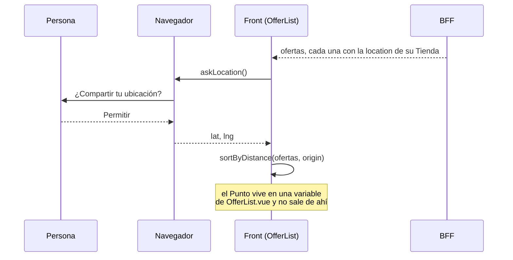

[English](location-privacy.md) · [Español](location-privacy.es.md)

# La Ubicación que no Sale del Navegador

Octubre 2026 · cómo Muchi ordena por Cercanía sin Saber dónde Estás

Muchi Ordena las Ofertas de la más cercana a la más lejana, y para eso
necesita un Punto: dónde Está quien Compra. **Muchi no Usa tu Ubicación en
sus Servidores**: el Punto no Viaja hacia ellos. Se Pide al Navegador, se Usa
en la Pantalla y se Pierde al Cerrar la Pestaña.

Este Documento cuenta el Mecanismo, qué Garantiza y qué no.

## La Ubicación se Pide, no se Toma

Quien Decide es el Navegador. Muchi llama a `navigator.geolocation` y el
Navegador le Pregunta a la Persona; sin su Permiso no hay Punto. Negado,
Indisponible o Lento Dicen lo mismo: no hay Origen.

La Pregunta Ocurre al Cargar las Ofertas, porque «Cerca mío» es el Orden por
defecto. Si la Respuesta es no, el Orden Queda por Precio y un Aviso lo Dice:
«No pude saber dónde estás». Nada se Rompe y nada se Insiste.

Tres Opciones Piden lo Mínimo, en [`nearby.js`](../web/src/nearby.js):

| Opción | Valor | Por qué |
| --- | --- | --- |
| `enableHighAccuracy` | `false` | Una Ciudad Alcanza para saber qué Tienda Queda cerca; la Precisión fina Cuesta Batería y no Cambia el Orden. |
| `timeout` | 8 segundos | Una Respuesta Lenta es una Respuesta no. |
| `maximumAge` | 10 minutos | El Navegador Reutiliza su última Lectura en vez de Medir otra vez. |

## El Recorrido de un Punto

1. **El BFF manda Lugares de Tiendas, no de Personas.** Cada Oferta Trae el
   `location` de su Tienda, leído de [`config/stores.yaml`](../config/stores.yaml)
   por [`places.py`](../server/places.py). Es un Archivo público, escrito a
   mano, igual para todos los Visitantes.
2. **El Front pide el Origen.** `askLocation()` Devuelve `{ lat, lng }` o
   `null`, y se Guarda en `origin`, una Referencia de Vue dentro de
   [`OfferList.vue`](../web/src/components/OfferList.vue).
3. **El Front Calcula.** `sortByDistance` Mide cada Tienda contra el Origen
   por Haversine y Reordena las Filas. Lo que Cambia es el Orden que se Ve;
   el Reparto de Cantidades sigue Leyendo las Ofertas por Precio.
4. **La Pantalla Dice el Resultado.** «A 52 km de ti» es la Distancia
   Redondeada, Dibujada y Olvidada.

## Por Qué el Servidor no Puede Enterarse

La Garantía no Descansa en una Promesa; Descansa en la Forma del Flujo.

- **La Petición no Lleva el Punto.** Las Peticiones Salen por
  [`api.js`](../web/src/api.js) con el Cuerpo que cada Pantalla le Entrega, y
  ninguna le Entrega `origin`. La Respuesta de Ofertas es la Misma para
  cualquier Visitante.
- **Solo `OfferList.vue` y `nearby.js` Tocan el Origen.** Ningún otro Archivo
  de `web/src` ni del BFF Llama a `navigator.geolocation` ni Lee la Variable.
- **Nada se Persiste.** El Origen no va a `localStorage` ni a
  `sessionStorage`. Recargar la Página es Volver a Preguntar; el Historial de
  Búsquedas Guarda un `id` y una Etiqueta, no Lugares.
- **El BFF no Tiene dónde Ponerlo.** `places.py` Solo Lee Tiendas. Ninguna
  Ruta Recibe un Punto, así que ninguna Podría Registrarlo.

Así Muchi Calcula una Cosa Íntima con un Dato Público: los Lugares de las
Tiendas Viajan hacia la Persona, y el Lugar de la Persona se Queda donde
Estaba.

## Lo que Esta Garantía no Cubre

- **La Dirección IP.** Cada Petición Web la Muestra, como en cualquier Sitio.
  Muchi no la Usa para Ubicar a nadie, pero este Documento no Puede decir que
  el Servidor no la Vea.
- **Los Scripts de Terceros.** Cuando hay una Cuenta, la Etiqueta de
  [AdSense](advertising.es.md) Corre en la misma Página. La Garantía Cubre el
  Código de Muchi, que no le Entrega el Punto a nadie; no Cubre lo que un
  Script Ajeno Pudiera Pedirle por su Cuenta al Navegador.
- **El Permiso Recordado.** Una Persona que Marcó «Permitir siempre» no ve
  la Pregunta de nuevo. Se Revoca en la Configuración del Navegador, no en
  Muchi.
- **La Precisión de las Tiendas.** Una Coordenada con `source: comuna` es
  el Centro de la Comuna, no la Puerta. Los Kilómetros Alcanzan para Ordenar
  y no para Caminar.
- **Una Prueba Automática de «nunca sale».** Los Tests Cubren el Orden, el
  Permiso Negado y los Lugares de las Tiendas
  ([`nearby.test.js`](../web/tests/nearby.test.js),
  [`test_web_api.py`](../tests/test_web_api.py)). Ninguno Afirma que el Punto
  no Viaje; hoy Eso se Verifica Leyendo, con `grep` por `origin` en `web/src`.

## Si Alguien Quiere Mandarlo

La Respuesta Corta es no. Una Función que Necesite el Punto en el Servidor,
por ejemplo Filtrar por Radio antes de Responder, Cambia la Promesa que Esta
Página Hace, y Cambiarla Pide Tres Cosas Juntas:

- Decirlo en la Interfaz, antes de la Pregunta del Navegador.
- Reescribir este Documento en los dos Idiomas.
- Un Test que Falle si el Punto aparece en una Petición.

Hasta Entonces, el Orden por Cercanía Ocurre en el Navegador de quien Compra,
y el Servidor solo Entrega las Tiendas.
