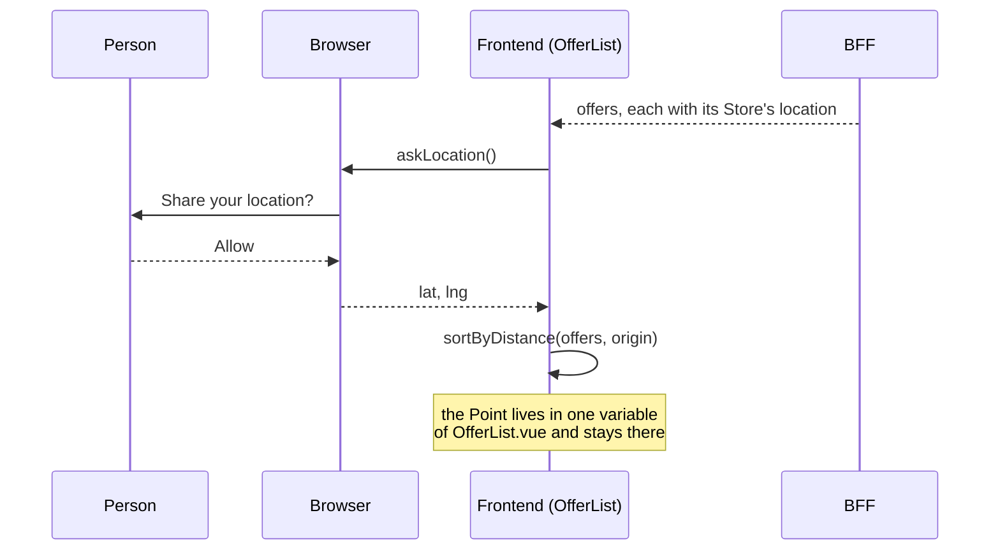

[English](location-privacy.md) · [Español](location-privacy.es.md)

# The Location That Never Leaves the Browser

October 2026 · how Muchi Sorts by Proximity without Knowing where you Are

Muchi Sorts Offers from nearest to farthest, and that needs a Point: where
the Buyer Is. **Muchi does not Use your Location on its Servers**: the Point
does not Travel to them. It is Asked from the Browser, Used on the Screen and
Lost when the Tab Closes.

This Document tells the Mechanism, what it Guarantees and what it does not.

## Location is Asked, never Taken

The Browser Decides. Muchi calls `navigator.geolocation` and the Browser Asks
the Person; without their Permission there is no Point. Denied, Unavailable or
Slow all Say the same: no Origin.

The Question Happens when Offers Load, because "Near me" is the default Order.
If the Answer is no, the Order Stays by Price and a Notice Says so: "I could
not tell where you are". Nothing Breaks and nothing Insists.

Three Options Ask for the Least, in [`nearby.js`](../web/src/nearby.js):

| Option | Value | Why |
| --- | --- | --- |
| `enableHighAccuracy` | `false` | A City is Enough to know which Store is close; fine Precision Costs Battery and never Changes the Order. |
| `timeout` | 8 seconds | A Slow Answer is a no Answer. |
| `maximumAge` | 10 minutes | The Browser Reuses its last Reading instead of Measuring again. |

## The Journey of a Point

1. **The BFF sends Store Places, not Person Places.** Each Offer Carries its
   Store's `location`, read from [`config/stores.yaml`](../config/stores.yaml)
   by [`places.py`](../server/places.py). It is a public File, written by
   hand, the same for every Visitor.
2. **The Frontend asks for the Origin.** `askLocation()` Returns
   `{ lat, lng }` or `null`, and it is Kept in `origin`, a Vue ref inside
   [`OfferList.vue`](../web/src/components/OfferList.vue).
3. **The Frontend Computes.** `sortByDistance` Measures every Store against
   the Origin by Haversine and Reorders the Rows. Only the Order that is Seen
   Changes; the Quantity Spread keeps Reading Offers by Price.
4. **The Screen Says the Result.** "A 52 km de ti" is the Distance Rounded,
   Drawn and Forgotten.

## Why the Server cannot Find Out

The Guarantee does not Rest on a Promise; it Rests on the Shape of the Flow.

- **The Request does not Carry the Point.** Requests Leave through
  [`api.js`](../web/src/api.js) with the Body each Screen Hands it, and none
  Hands it `origin`. The Offers Response is the Same for any Visitor.
- **Only `OfferList.vue` and `nearby.js` Touch the Origin.** No other File in
  `web/src` or in the BFF Calls `navigator.geolocation` or Reads the variable.
- **Nothing is Persisted.** The Origin goes to neither `localStorage` nor
  `sessionStorage`. Reloading the Page is Asking again; the Search History
  Keeps an `id` and a Label, never Places.
- **The BFF has nowhere to Put it.** `places.py` Reads only Stores. No Route
  Receives a Point, so none could Log one.

So Muchi Computes something Intimate from a Public Fact: Store Places Travel
toward the Person, and the Person's Place Stays where it Was.

## What this Guarantee does not Cover

- **The IP Address.** Every Web Request Shows it, as at any Site. Muchi does
  not Use it to Locate anyone, but this Document cannot say the Server does
  not See it.
- **Third-party Scripts.** When an Account is Set, the
  [AdSense](advertising.md) Tag Runs on the same Page. The Guarantee Covers
  Muchi's Code, which Hands the Point to no one; it does not Cover what a
  Foreign Script could Ask the Browser for on its own.
- **A Remembered Permission.** A Person who Chose "Always allow" does not see
  the Question again. It is Revoked in the Browser Settings, not in Muchi.
- **Store Precision.** A Coordinate with `source: comuna` is the Center of
  the Comuna, not the Door. The Kilometers are Enough to Sort and not to Walk.
- **An Automatic Proof of "never leaves".** The Tests Cover the Order, the
  Denied Permission and the Store Places
  ([`nearby.test.js`](../web/tests/nearby.test.js),
  [`test_web_api.py`](../tests/test_web_api.py)). None Asserts that the Point
  does not Travel; today That is Checked by Reading, with a `grep` for
  `origin` in `web/src`.

## If Someone Wants to Send it

The Short Answer is no. A Feature that Needs the Point on the Server, such as
Filtering by Radius before Answering, Changes the Promise this Page Makes, and
Changing it Asks for Three Things Together:

- Say it in the Interface, before the Browser's Question.
- Rewrite this Document in both Languages.
- A Test that Fails if the Point Appears in a Request.

Until Then, Sorting by Proximity Happens in the Buyer's Browser, and the
Server only Delivers the Stores.
