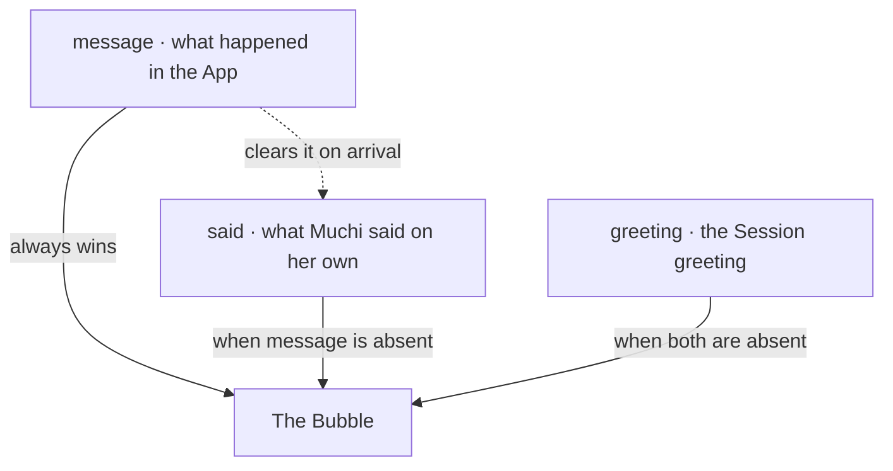
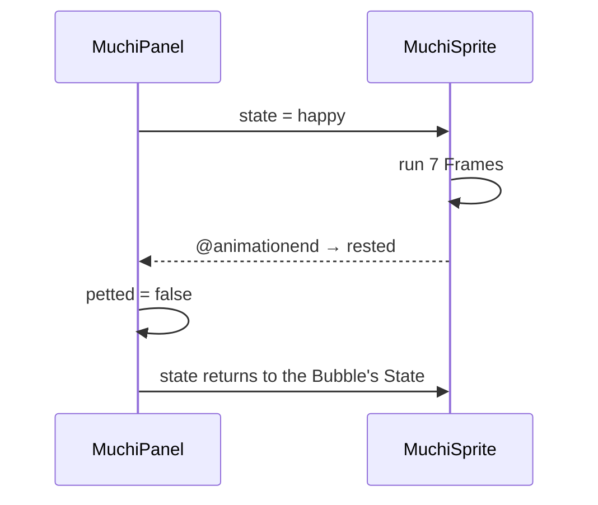

[English](muchi-habla-en.md) · [Español](muchi-habla.md)

# How Muchi Speaks

Muchi is a Cat commenting on what happens. She says she has gone searching,
complains when a Store has no Stock, wakes when petted and changes her Face
while speaking. This Document explains the three Parts behind that behavior
and why they are separate.

| Part | Question It Answers | Location |
| --- | --- | --- |
| Catalog | What Muchi can say | [`constants/phrases.yaml`](../constants/phrases.yaml) on the Server |
| Bubble | What she says now, and who took the turn | [`MuchiPanel.vue`](../web/src/components/MuchiPanel.vue) |
| Sheet | What she looks like while saying it | [`MuchiSprite.vue`](../web/src/components/MuchiSprite.vue) |

All three share one Vocabulary: five States. Text says `happy`, and the
Sheet already knows which Row that means.

## The Five States

State is the visual Protocol. The Server declares it in
[`muchi/mtg/phrases.py`](../muchi/mtg/phrases.py) as
`STATES = frozenset({"idle", "talk", "happy", "alert", "angry"})`;
the Sprite sheet draws one Row per State.

| State | When It Appears | Row | Frames | Timing | Returns Automatically |
| --- | --- | --- | --- | --- | --- |
| `idle` | Rest, and Muchi cancelling a Search | 0 | 16 | 130 ms | Loops |
| `talk` | Greetings and Name suggestions | 1 | 6 | 90 ms | Loops |
| `happy` | Search submitted, Petting, Dark mode | 2 | 8 | 80 ms | Ends and signals |
| `alert` | Catalog nerves, Light mode | 3 | 6 | 100 ms | Ends and signals |
| `angry` | Any Failure Muchi reports | 4 | 6 | 90 ms | Ends and signals |

Numbers live in [`web/src/assets/muchi-sheets.json`](../web/src/assets/muchi-sheets.json).
Changing `talk` timing means editing an `ms` value. The
[Sprite lab](muchi-sprite-lab-en.html) lets you inspect Frames before editing the Sheet.

A State the Sheet does not draw falls back to `idle` before requesting a
nonexistent Row. Without that guard, the Film would move beyond the Sheet
and leave Muchi blank: malformed Text would switch off the Cat.

## The Catalog Lives on the Server

Everything Muchi can say lives in one File. No Phrase is compiled into
the Frontend:

```yaml
every: 10
phrases:
  - state: angry
    phrases:
      - ¿Otra vez sin Stock? Grrr, las Tiendas se portan mal
greetings:
  - text: Miau, ¿en qué te ayudo?
    state: talk
```

These are the original Spanish phrases: a complaint about Stock and a greeting.
`GET /api/muchi` returns the complete Catalog: `every`, `phrases`,
`greetings`, `dark`, `light`, `nerd`, `libre` and `help`. The Frontend requests
it once on mount alongside `/api/config` and stores it in `book`.

A new Phrase should not require a Frontend build or Hosting deployment.
Text is Content.

The Server validates that Content strictly. `build_phrase_book` requires
exactly eight Keys, rejects empty Groups, requires a positive Integer for
`every` and rejects States outside the five. Validation happens on read:
`state: contenta` fails on the Server with a clear Error, before reaching
the Browser and leaving Muchi blank.

A missing File is not a Failure: it returns an empty Catalog and Muchi
stays quiet. Messages decorate the Product; they are not its Function.

One Group has two uses. Muchi says `rayozz no la encontré` when petted;
the Server also uses it as the `404` detail when a Card does not exist.
[`server/main.py`](../server/main.py) finds it by Text so the Failure
sounds like the Cat instead of the Framework.

## Who Speaks and When

The Bubble has three Sources with strict Precedence:



`message` comes from [`App.vue`](../web/src/App.vue), set by
`say(text, mood)`. `said` starts inside the Panel after Petting or toggling
the Light. The Greeting is chosen once per Session and remembered;
choosing on every Render would change it whenever Vue repaints the Panel.

A `watch` clears `said` when a `message` arrives. Otherwise, an old Light
comment would reappear after a Search, as though Muchi were resuming a
Conversation nobody was having.

These are all the Triggers. Quoted speech below translates the Spanish UI:

| Event | What She Says | State |
| --- | --- | --- |
| Search created | "Meow! I'm off to search" | `happy` |
| Search cancelled | "I've stopped searching" | `idle` |
| Submission failed | The Failure message as received | `angry` |
| Search found no Card | The Failure message | `angry` |
| Search found similar Names | "Were you looking for ‘…’?" | `talk` |
| Someone opened Statistics | A Phrase from `nerd` | `happy` |
| Someone touched or hovered over the Open source notice | A Phrase from `libre` | The Group's State |
| Petting count reaches `every` (10) | A random Phrase from `phrases` | The Group's State |
| Dark mode enabled | One from `dark` | `happy` |
| Dark mode disabled | One from `light` | `alert` |

Muchi jumps on every Tap but speaks only every tenth one. The Counter
appears from the third. A Cat commenting on every Click stops being funny
by the fourth.

## Three Channels

Muchi speaking and the Page issuing a Notice are different things,
shown deliberately in different Places:

| Channel | Content | Location |
| --- | --- | --- |
| Bubble | Muchi's Voice: opinion, Greeting, comment | Inside the Cat panel |
| Error notice | The Operation failure, literal and actionable | `.mu-aviso.error`, below the Form |
| Notes | What the API reports about the Search | Above the Offer list |

Submission failures use two Channels at once. `error.value` gets the raw
Text for anyone needing Details, and `say(..., 'angry')` repeats it with
the Cat's Face. Someone looking for the Cause finds it in its usual place;
someone just watching the Screen still notices.

API Notes carry a `level`. Only `warning` renders as a Notice; others become
Footnotes. Keeping Yellow scarce preserves its meaning.

## The Alert That Opens the Dock

On Mobile, Muchi lives in a Dock: a round corner Button that expands on Tap.
It starts closed because searchers want to see Offers.

There is one explicit exception:

```js
watch(message, (said) => { if (said?.state === 'angry') dockOpen.value = true })
```

Only `angry` opens the Dock automatically. Viewing a Card does not open it
— Muchi would cover what you asked to see — and neither does `happy`, which
fits in the Bar. A Failure is the only reason to take over that Screen space.

Other speech is announced without expanding. When closed with something
said, the Button has a corner Dot (`.mu-muelle:not(.abierto).dijo`): Muchi
signals she spoke and lets you decide when to read it.

## How Animation Works

### The Film and the Window

`muchi-sofi-sheet.png` has eight Columns and five Rows, inspired by the
orange Cat in Sofi's reference. Each State has eight Frames. The Component
keeps a logical 24×24 Window at scale 4 and slides the whole Sheet beneath it.

- The Row is selected by moving the Film along Y.
- Frames advance along X with `steps()`, so the Browser jumps between
  Frames instead of interpolating. Without it, the Drawing simply slides.
- Movement uses `transform`. Moving `background-position` resamples the
  Sheet on each Frame and can reveal a line from the Row above on screens
  with fractional DPI. `transform` slides the already rasterized Layer,
  and the Window clips it cleanly.
- `background-size: 100% 100%` fits the Sheet to the logical Grid;
  `image-rendering: pixelated` preserves edges when scaling.

### Animations That End

Three States do not loop: `happy`, `alert` and `angry` have a beginning and
an end. Two Details matter visually.

A finite Animation runs one fewer Frame. In a Loop, jumping from last to
first reads as a cut; trimming the last lets the Cycle close where it began.

A completed Animation would freeze forever, so it signals completion:



Repeating the same State must animate again. Vue reuses an Element if its
Key stays unchanged, and a finished Animation does not restart itself.
A `tick` increases on every State change to force a new Element; without
it, the second consecutive Pet would do nothing.

### The Other Four Animations

| Animation | Trigger | Implementation |
| --- | --- | --- |
| Jump (`mu-salta`) | Every Pet | 400 ms of `translateY`, released by `setTimeout` |
| Hearts (`mu-sube`) | "Muchi, ayudame!" (Muchi, help me!) | Six Emojis with random Drift, Rotation and Delay |
| Progress bar | Every Poll | `transition: width .3s` on the Percentage |
| Buttons | Hover | `translateY(-1px)` over 150 ms |

Hearts appear six at a time, each with its own `--desvio`, `--giro` and
`animationDelay`, so they do not rise in a straight List. Their Layer uses
`pointer-events: none`, preventing them from covering the originating
Button. Each is removed on completion, keeping the Array from growing
forever while someone keeps pressing.

## For People Who Requested Less Motion

`prefers-reduced-motion: reduce` preserves Information while reducing
Movement. Each Animation has a specific response:

| Animation | With Reduced Motion |
| --- | --- |
| Muchi's Sheet | Stays on the first Frame, already a complete resting Pose |
| Hearts | Hidden; the Button still changes to "Gracias Muchi 💝" (Thanks Muchi) |
| Buttons | No `transition`; the State remains visible |

Muchi still speaks, changes Face with State and opens the Dock on Failure.
Only Movement is lost, exactly as requested.

Needing no separate resting Drawing is a Sheet decision: Frame 0 in every
Row was drawn to work while still.

## Decisions and Limits

- App phrases are not multilingual yet. The Catalog has one Language.
  A second requires another YAML key and selection in `/api/muchi`,
  rather than a parallel File.
- The Bubble has no History. It shows one thing and replaces it. A speech
  Log would require another Component and Decision.
- Messages do not expire. They stay until replaced. A Timer could remove
  a Failure someone is still reading.
- The Catalog is read once per Process (`lru_cache`). Editing
  `phrases.yaml` in Production requires restarting the Service; in return,
  Requests do not pay for Disk reads.
- Five States are deliberately few. Each new State requires someone to
  draw another Row in five coherent Poses. The Limit is Illustration.

## Where to Look

1. [`constants/phrases.yaml`](../constants/phrases.yaml): everything Muchi can say.
2. [`muchi/mtg/phrases.py`](../muchi/mtg/phrases.py): Validation and invalid
   Catalog behavior.
3. [`web/src/components/MuchiPanel.vue`](../web/src/components/MuchiPanel.vue):
   Bubble precedence, Petting and Hearts.
4. [`web/src/components/MuchiSprite.vue`](../web/src/components/MuchiSprite.vue):
   Film, `steps()` and the rest Signal.
5. [`web/src/App.vue`](../web/src/App.vue): callers of `say` and the one
   line that opens the Dock.
