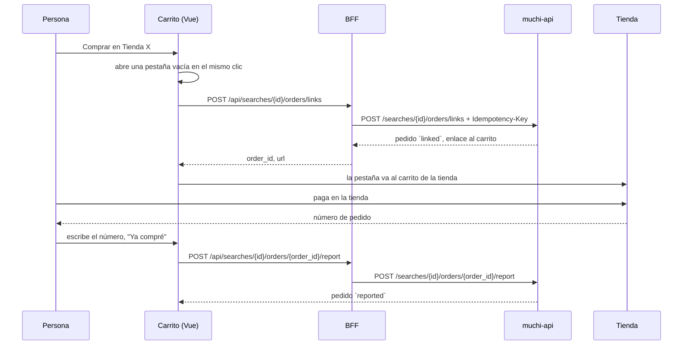
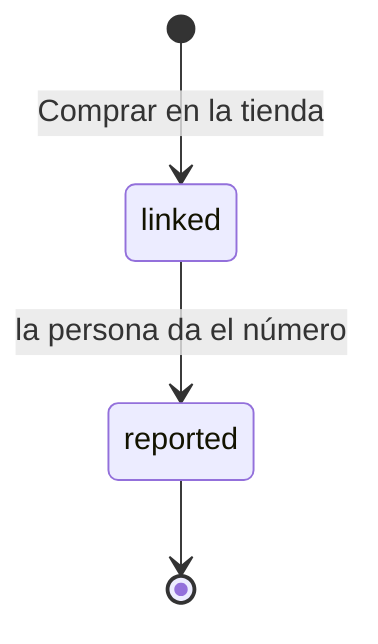

[English](reported-purchases.md) · [Español](reported-purchases.es.md)

# Compras Informadas

Septiembre 2026 · lo que hace el carrito hoy, un paso más allá de una lista de enlaces

Muchi todavía no compra por ti. Lo que cambió es que ahora recuerda a dónde
fuiste a comprar, y te pregunta qué pasó cuando vuelves.

## Por Qué el Front No Puede Saberlo Solo

Cuando sigues el enlace al carrito de una tienda, sales de Muchi. El pago
ocurre en el dominio de la tienda, y el navegador no deja que un sitio lea a
otro. Una tienda Shopify tampoco devuelve a nadie a Muchi después de pagar,
salvo que su dueño instale algo para eso. Así que el front no puede ver si
compraste ni qué número te dio la tienda.

La única persona que lo sabe eres tú. Muchi pregunta, y anota tu respuesta
como exactamente eso: tu respuesta.

## El Flujo

1. **Comprar en Tienda X.** Un botón por tienda en el carrito. Manda solo las
   líneas de esa tienda, con una clave de idempotencia nueva, y la API anota
   un pedido `linked`. El enlace es el carrito de la tienda cuando lo tiene;
   si no, la página del primer producto, y el resto de las líneas siguen en
   el carrito.
2. **La pestaña se abre en el mismo clic.** Los navegadores bloquean una
   ventana abierta después de esperar a un servidor. El carrito abre primero
   una pestaña vacía y la manda a la tienda cuando la API responde; si la API
   falla, la pestaña se cierra y el error aparece bajo la tienda.
3. **De vuelta en Muchi.** La tienda ahora pregunta "¿Terminaste la compra?
   Número de pedido", con un enlace para volver a la tienda si se cerró la
   pestaña.
4. **Ya compré.** El número va a la API, que mueve el pedido a `reported`.
   Repetir el mismo número no hace daño; uno distinto se rechaza, así un
   segundo toque no pisa la primera respuesta.
5. **Listo.** La tienda muestra "Compra informada · pedido #1042". Dice
   *informada*, nunca *confirmada*: nadie lo comprobó con la tienda.

## Qué Vive Dónde

| Pieza | Lugar | Contiene |
| --- | --- | --- |
| Botones, formulario del número | [`CartPanel.vue`](../web/src/components/CartPanel.vue) | estado por tienda, un clic abre la pestaña |
| Líneas, limpieza, memoria | [`purchase.js`](../web/src/purchase.js) | qué líneas van, el número recortado a 64 caracteres, `sessionStorage` por búsqueda |
| Llamadas | [`api.js`](../web/src/api.js) | `linkStoreOrder`, `reportStoreOrder` |
| Rutas del BFF | [`server/main.py`](../server/main.py) | `/api/searches/{id}/orders/links`, `/api/searches/{id}/orders/{order_id}/report` |
| Cliente de la API | [`muchi/api/client.py`](../muchi/api/client.py) | `link_order`, `report_order`, `StoreOrder` |

`sessionStorage` solo evita que una recarga olvide que ya saliste a una
tienda. El pedido vive en muchi-api; el token nunca llega al navegador.

## Qué No Hace

- **No compra.** El pago, la dirección y la tarjeta quedan entre tú y la
  tienda.
- **No verifica.** Un número mal escrito o inventado se guarda tal cual.
- **No libera nada.** Un pedido `linked` que nadie informa simplemente queda
  `linked`.
- **No reemplaza los pedidos reales.** Donde muchi-api puede hacer el pedido
  por su cuenta (tiendas WooCommerce, todavía en piloto), ese camino se
  confirma con el webhook de la propia tienda. Este flujo es para todas las
  demás.

## Por Qué Esto Primero

Funciona hoy en todas las tiendas y para todos los juegos, sin automatizar
navegadores, sin pelear con protecciones anti-bots y sin que pase dinero por
Muchi. También le da a [Cuando Muchi Compre](when-muchi-buys.es.md) su primer
número real: cuánta gente llega al carrito de una tienda, y cuántos vuelven
diciendo que compraron.

El lado de la API se describe en muchi-api,
[Checkout Sin Agentes](https://github.com/cangrejometralleta/muchi-api/blob/main/docs/checkout/agentless-checkout.es.md).
