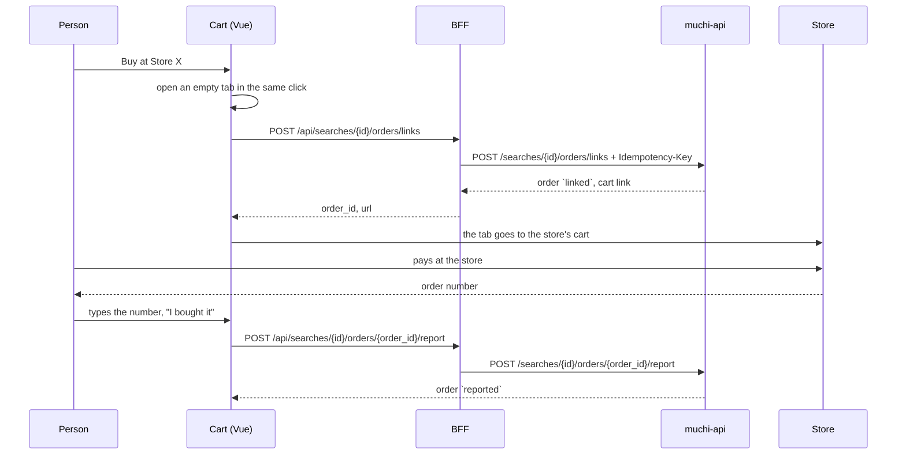
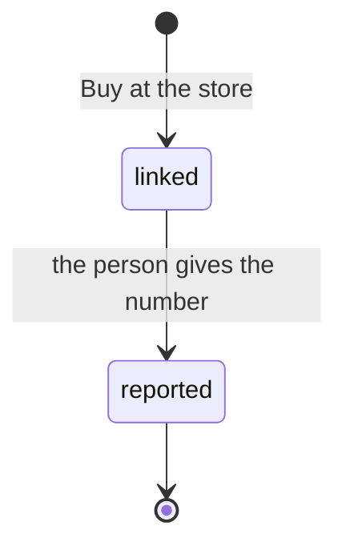

[English](reported-purchases.md) · [Español](reported-purchases.es.md)

# Reported Purchases

September 2026 · what the cart does today, one step past a list of links

Muchi still does not buy for you. What changed is that it now remembers where
you went to buy, and asks what happened when you come back.

## Why the Front Cannot Know on Its Own

When you follow a store's cart link you leave Muchi. The checkout runs on the
store's own domain, and the browser does not let one site read another. A
Shopify store also sends nobody back to Muchi after payment unless its owner
installs something for that. So the front cannot see whether you bought, or
what number the store gave you.

The only one who knows is you. Muchi asks, and writes down your answer as
exactly that: your answer.

## The Flow

1. **Buy at Store X.** One button per store in the cart. It sends only that
   store's lines, with a fresh idempotency key, and the API records a
   `linked` order. The link is the store's own cart when it has one;
   otherwise it is the first product page and the rest of the lines stay in
   the cart.
2. **The tab opens in the same click.** Browsers block a window opened after
   waiting for a server. The cart opens an empty tab first and sends it to the
   store once the API answers; if the API fails, the tab closes and the error
   shows under the store.
3. **Back in Muchi.** The store now asks "Did you finish the purchase? Order
   number", with a link back to the store in case the tab was closed.
4. **I bought it.** The number goes to the API, which moves the order to
   `reported`. Repeating the same number is harmless; a different one is
   rejected, so a second tap cannot overwrite the first answer.
5. **Done.** The store shows "Purchase reported · order #1042". It says
   *reported*, never *confirmed*: nobody checked it with the store.

## What Lives Where

| Piece | Place | Holds |
| --- | --- | --- |
| Buttons, number form | [`CartPanel.vue`](../web/src/components/CartPanel.vue) | per-store state, one click opens the tab |
| Lines, cleaning, memory | [`purchase.js`](../web/src/purchase.js) | which lines go, the number trimmed to 64 characters, `sessionStorage` per search |
| Calls | [`api.js`](../web/src/api.js) | `linkStoreOrder`, `reportStoreOrder` |
| BFF routes | [`server/main.py`](../server/main.py) | `/api/searches/{id}/orders/links`, `/api/searches/{id}/orders/{order_id}/report` |
| API client | [`muchi/api/client.py`](../muchi/api/client.py) | `link_order`, `report_order`, `StoreOrder` |

`sessionStorage` only saves a reload from forgetting that you already left for
a store. The order itself lives in muchi-api; the token never reaches the
browser.

## What It Does Not Do

- **It does not buy.** Payment, address and card stay between you and the
  store.
- **It does not verify.** A mistyped or invented number is stored as given.
- **It does not release anything.** A `linked` order that nobody reports
  simply stays `linked`.
- **It does not replace real orders.** Where muchi-api can place the order
  itself (WooCommerce stores, still in pilot), that path confirms with the
  store's own webhook. This flow is for every other store.

## Why This First

It works today at every store and for every game, with no browser automation,
no bot protection to fight and no money moving through Muchi. It also gives
[When Muchi Buys](when-muchi-buys.md) its first real number: how many people
reach a store's cart, and how many come back saying they bought.

The API side is described in muchi-api,
[Checkout Without Agents](https://github.com/cangrejometralleta/muchi-api/blob/main/docs/checkout/agentless-checkout.md).
